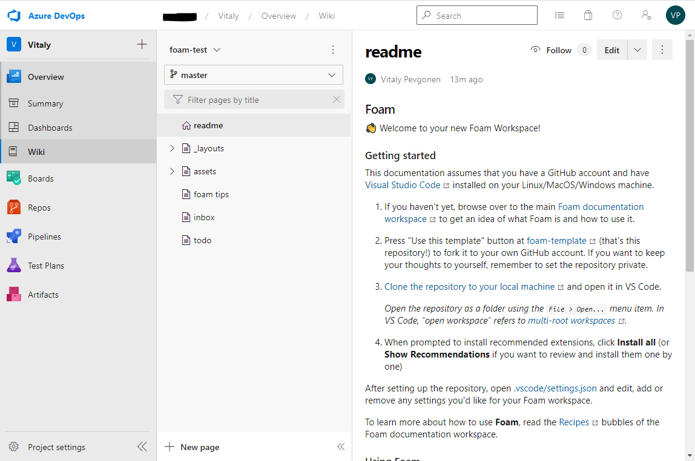

# Azure DevOps Wiki

Publish your Foam workspace as an Azure DevOps wiki.

[Azure DevOps](https://azure.microsoft.com/en-us/services/devops/) is Microsoft's collaboration software for software development teams, formerly known as Team Foundation Server (TFS) and Visual Studio Team Services. It is available as an on-premise or SaaS version. The following recipe was tested with the SaaS version, but should work the same way for the on-premise.

The following recipe is written with the assumption that you already have an [Azure DevOps](https://azure.microsoft.com/en-us/services/devops/) project.

## Setup a Foam workspace

1. Generate a Foam workspace using the [foam-template project](https://github.com/foambubble/foam-template). 
2. Change the remote to a git repository in Azure DevOps, or copy all the files into a new Azure DevOps git repository.
3. Define which document will be the wiki default page. To do that, create a file called `.order` in the Foam workspace root folder, with first line being the document filename without `.md` extension. For a project created from the Foam template, the file would look like this:

## Publish repository to a wiki

Process is better described in [Azure DevOps documentation](https://docs.microsoft.com/en-us/azure/devops/project/wiki/publish-repo-to-wiki). Navigate to your Azure DevOps project in web browser, choose **Overview** > **Wiki**. If you don't have wikis for your project, choose **Publish code as a wiki** on welcome page. Choose repository with your Foam workspace, branch (usually `master`), folder (for workspace created from foam-template it is `/`), and wiki name, and press **Publish**.

Published workspace would look like this

There is default TOC pane to the left of the wiki content. Here are listed all directories that present in Foam workspace, and all wiki pages. Pages names are derived from files names, and they are listed in alphabetical order. You may reorder pages by adding filenames without `.md` extension to `.order` file. Note that first entry in `.order` file defines wiki's home page.
