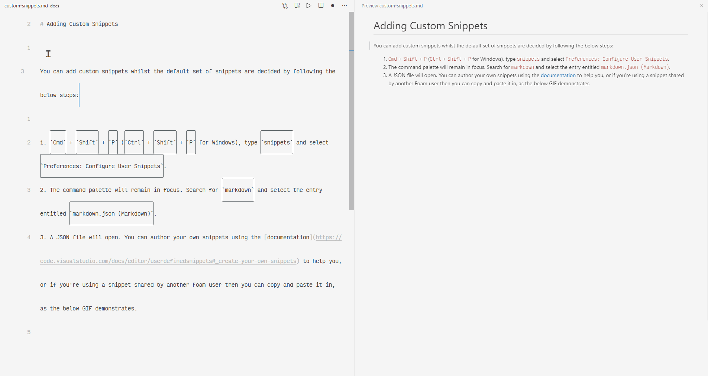

# Adding Custom Snippets

You can add custom snippets whilst the default set of snippets are decided by following the below steps:

1. `Cmd` + `Shift` + `P` (`Ctrl` + `Shift` + `P` for Windows), type `snippets` and select `Preferences: Configure User Snippets`.
2. The command palette will remain in focus. Search for `markdown` and select the entry entitled `markdown.json (Markdown)`.
3. A JSON file will open. You can author your own snippets using the [documentation](https://code.visualstudio.com/docs/editor/userdefinedsnippets#_create-your-own-snippets) to help you, or if you're using a snippet shared by another Foam user then you can copy and paste it in, as the below GIF demonstrates:
   

To get started, you might consider replacing the entire contents of the `markdown.json` file opened by the steps above with the JSON in [this comment](https://github.com/foambubble/foam/pull/192#issuecomment-666736270).
