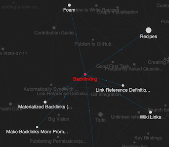

# Graph Visualisation

Foam comes with a graph visualisation.
The graph will:
- allow you to highlight a node by hovering on it, to quickly see how it's connected to the rest of your notes
- allow you to select one or more (by keeping `SHIFT` pressed while selecting) nodes by clicking on them, to better understand the structure of your notes
- to navigate to a note by clicking on it while pressing `CTRL` or `CMD`
- automatically center the graph on the currently edited note, to immediately see it's connections

## Custom Graph Styles

Currently, custom graph styles are supported through the `foam.graph.style` setting.


A sample configuration object is provided below:

```json
"background": "#202020",
"fontSize": 12,
"highlightedForeground": "#f9c74f",
"node": {
    "note": "#277da1",
    "placeholder": "#545454",
}
```

### Style nodes by type
It is possible to customize the style of a node based on the `type` property in the YAML frontmatter of the corresponding document.

For example the following `backlinking.md` note:

```
---
type: feature
---
# Backlinking

...
```

And the following `settings.json`:
```json
"foam.graph.style": {
    "node": {
        "feature": "red",
    }
}
```

Will result in the following graph:



### Markdown Links
Another extension that provides a great graph visualisation is [Markdown Links](https://marketplace.visualstudio.com/items?itemName=tchayen.markdown-links).
The extension doesn't use the Foam model, so discrepancies might arise, but it's a great visualisation extension nonetheless!

- Use the `Markdown Links: Show Graph` command to see the graph


