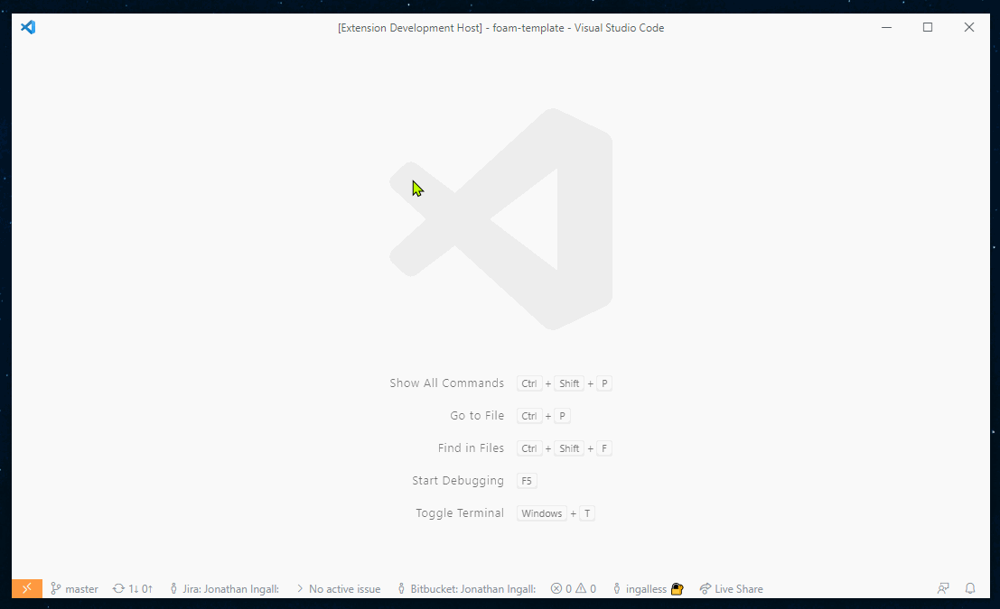
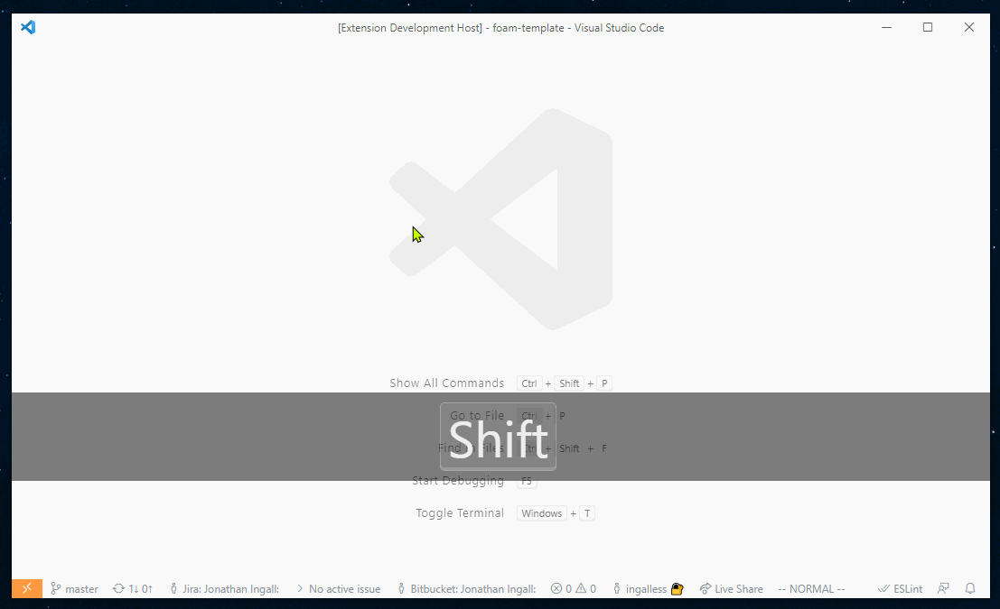

# Note Templates

Foam supports note templates.

Note templates live in `.foam/templates`. Run the `Foam: Create New Template` command from the command palette or create a regular `.md` file there to add a template.

_Theme: Ayu Light_

To create a note from a template, execute the `Foam: Create New Note From Template` command and follow the instructions. Don't worry if you've not created a template yet! You'll be prompted to create a new template if none exist.

_Theme: Ayu Light_

Templates can use all the variables available in [VS Code Snippets](https://code.visualstudio.com/docs/editor/userdefinedsnippets#_variables).
