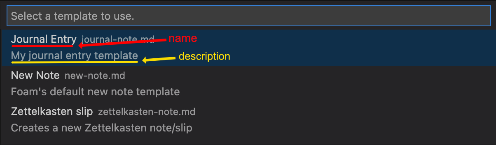

# Note Templates

Foam supports note templates. Templates are a way to customize the starting content for your notes (instead of always starting from an empty note).

Note templates are files located in the special `.foam/templates` directory.

## Quickstart

Create a template:

* Run the `Foam: Create New Template` command from the command palette
* OR manually create a regular `.md` file in the `.foam/templates` directory


_Theme: Ayu Light_

To create a note from a template:

* Run the `Foam: Create New Note From Template` command and follow the instructions. Don't worry if you've not created a template yet! You'll be prompted to create a new template if none exist.
* OR run the `Foam: Create New Note` command, which uses the special default template (`.foam/templates/new-note.md`, if it exists)


_Theme: Ayu Light_

## Special templates
### Default template

The `.foam/templates/new-note.md` template is special in that it is the template that will be used by the `Foam: Create New Note` command.
Customize this template to contain content that you want included every time you create a note.

### Default daily note template

The `.foam/templates/daily-note.md` template is special in that it is the template that will be used when creating daily notes (e.g. by using `Foam: Open Daily Note`).
Customize this template to contain content that you want included every time you create a daily note.

## Variables

Templates can use all the variables available in [VS Code Snippets](https://code.visualstudio.com/docs/editor/userdefinedsnippets#_variables).

In addition, you can also use variables provided by Foam:

| Name                 | Description                                                                                                                                                                                                                 |
| -------------------- | --------------------------------------------------------------------------------------------------------------------------------------------------------------------------------------------------------------------------- |
| `FOAM_SELECTED_TEXT` | Foam will fill it with selected text when creating a new note, if any text is selected. Selected text will be replaced with a wikilink to the new note.                                                                     |
| `FOAM_TITLE`         | The title of the note. If used, Foam will prompt you to enter a title for the note.                                                                                                                                         |
| `FOAM_SLUG`          | The sluggified title of the note (using the default github slug method). If used, Foam will prompt you to enter a title for the note unless `FOAM_TITLE` has already caused the prompt.                                     |
| `FOAM_DATE_*`        | `FOAM_DATE_YEAR`, `FOAM_DATE_MONTH`, etc. Foam-specific versions of [VS Code's datetime snippet variables](https://code.visualstudio.com/docs/editor/userdefinedsnippets#_variables). Prefer these versions over VS Code's. |

### `FOAM_DATE_*` variables

Foam defines its own set of datetime variables that have a similar behaviour as [VS Code's datetime snippet variables](https://code.visualstudio.com/docs/editor/userdefinedsnippets#_variables).

For example, `FOAM_DATE_YEAR` has the same behaviour as VS Code's `CURRENT_YEAR`, `FOAM_DATE_SECONDS_UNIX` has the same behaviour as `CURRENT_SECONDS_UNIX`, etc.

By default, prefer using the `FOAM_DATE_` versions. The datetime used to compute the values will be the same for both `FOAM_DATE_` and VS Code's variables, with the exception of the creation notes using the daily note template.

#### Relative daily notes

When referring to daily notes, you can use the relative snippets (`/+1d`, `/tomorrow`, etc.). In these cases, the new notes will be created with the daily note template, but the datetime used should be the relative datetime, not the current datetime.
By using the `FOAM_DATE_` versions of the variables, the correct relative date will populate the variables, instead of the current datetime.

For example, given this daily note template (`.foam/templates/daily-note.md`):

```markdown
# $FOAM_DATE_YEAR-$FOAM_DATE_MONTH-$FOAM_DATE_DATE

## Here's what I'm going to do today

* Thing 1
* Thing 2
```

When the `/tomorrow` snippet is used, `FOAM_DATE_` variables will be populated with tomorrow's date, as expected.
If instead you were to use the VS Code versions of these variables, they would be populated with today's date, not tomorrow's, causing unexpected behaviour.

When creating notes in any other scenario, the `FOAM_DATE_` values are computed using the same datetime as the VS Code ones, so the `FOAM_DATE_` versions can be used in all scenarios by default.

## Metadata

Templates can also contain metadata about the templates themselves. The metadata is defined in YAML "Frontmatter" blocks within the templates.

| Name          | Description                                                                                                                      |
| ------------- | -------------------------------------------------------------------------------------------------------------------------------- |
| `filepath`    | The filepath to use when creating the new note. If the filepath is a relative filepath, it is relative to the current workspace. |
| `name`        | A human readable name to show in the template picker.                                                                            |
| `description` | A human readable description to show in the template picker.                                                                     |

Foam-specific variables (e.g. `$FOAM_TITLE`) can be used within template metadata. However, VS Code snippet variables are ([currently](https://github.com/foambubble/foam/pull/655)) not supported.

### `filepath` attribute

The `filepath` metadata attribute allows you to define a relative or absolute filepath to use when creating a note using the template.
If the filepath is a relative filepath, it is relative to the current workspace.

**Note:** While you can make use of the `filepath` attribute in [daily note](daily-notes.md) templates (`.foam/templates/daily-note.md`), there is currently no way to have `filepath` vary based on the date. This will be improved in the future. For now, you can customize the location of daily notes using the [`foam.openDailyNote` settings](daily-notes.md).

#### Example of relative `filepath`

For example, `filepath` can be used to customize `.foam/templates/new-note.md`, overriding the default `Foam: Create New Note` behaviour of opening the file in the same directory as the active file:

```yaml
---
# This will create the note in the "journal" subdirectory of the current workspace,
# regardless of which file is the active file.
foam_template:
  filepath: 'journal/$FOAM_TITLE.md'
---
```

#### Example of absolute `filepath`

`filepath` can be an absolute filepath, so that the notes get created in the same location, regardless of which file or workspace the editor currently has open.
The format of an absolute filepath may vary depending on the filesystem used.

```yaml
---
foam_template:
  # Unix / MacOS filesystems
  filepath: '/Users/john.smith/foam/journal/$FOAM_TITLE.md'

  # Windows filesystems
  filepath: 'C:\Users\john.smith\Documents\foam\journal\$FOAM_TITLE.md'
---
```

### `name` and `description` attributes

These attributes provide a human readable name and description to be shown in the template picker (e.g. When a user uses the `Foam: Create New Note From Template` command):



### Adding template metadata to an existing YAML Frontmatter block

If your template already has a YAML Frontmatter block, you can add the Foam template metadata to it.

#### Limitations

Foam only supports adding the template metadata to *YAML* Frontmatter blocks. If the existing Frontmatter block uses some other format (e.g. JSON), you will have to add the template metadata to its own YAML Frontmatter block.

Further, the template metadata must be provided as a [YAML block mapping](https://yaml.org/spec/1.2/spec.html#id2798057), with the attributes placed on the lines immediately following the `foam_template` line:

```yaml
---
existing_frontmatter: "Existing Frontmatter block"
foam_template: # this is a YAML "Block" mapping ("Flow" mappings aren't supported)
  name: My Note Template # Attributes must be on the lines immediately following `foam_template`
  description: This is my note template
  filepath: `journal/$FOAM_TITLE.md`
---
This is the rest of the template
```

Due to the technical limitations of parsing the complex YAML format, unless the metadata is provided this specific form, Foam is unable to correctly remove the template metadata before creating the resulting note.

If this limitation proves inconvenient to you, please let us know. We may be able to extend our parsing capabilities to cover your use case. In the meantime, you can add the template metadata without this limitation by providing it in its own YAML Frontmatter block.

### Adding template metadata to its own YAML Frontmatter block

You can add the template metadata to its own YAML Frontmatter block at the start of the template:

```yaml
---
foam_template:
  name: My Note Template
  description: This is my note template
  filepath: `journal/$FOAM_TITLE.md`
---
This is the rest of the template
```

If the note already has a Frontmatter block, a Foam-specific Frontmatter block can be added to the start of the template. The Foam-specific Frontmatter block must always be placed at the very beginning of the file, and only whitespace can separate the two Frontmatter blocks.

```yaml
---
foam_template:
  name: My Note Template
  description: This is my note template
  filepath: `journal/$FOAM_TITLE.md`
---

---
existing_frontmatter: "Existing Frontmatter block"
---
This is the rest of the template
```
