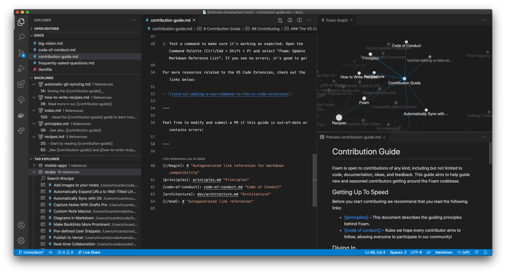

# Foam

**Foam** is a personal knowledge management and sharing system inspired by [Roam Research](https://roamresearch.com/), built on [Visual Studio Code](https://code.visualstudio.com/) and [GitHub](https://github.com/).

You can use **Foam** for organising your research, keeping re-discoverable notes, writing long-form content and, optionally, publishing it to the web.

**Foam** is free, open source, and extremely extensible to suit your personal workflow. You own the information you create with Foam, and you're free to share it, and collaborate on it with anyone you want.

  <b>New!</b> Join <a href="https://discord.gg/rtdZKgj" target="_blank">Foam community Discord</a> for users and contributors!

    <a class="github-button" href="https://github.com/foambubble/foam" data-icon="octicon-star" data-size="large" data-show-count="true" aria-label="Star foambubble/foam on GitHub">Star</a> 
    <a class="github-button" href="https://github.com/foambubble/foam-template" data-icon="octicon-repo-template" data-size="large" aria-label="Use this template foambubble/foam-template on GitHub">Use this template</a>

## Table of Contents

- [Foam](#foam)
  - [Table of Contents](#table-of-contents)
  - [How do I use Foam?](#how-do-i-use-foam)
  - [What's in a Foam?](#whats-in-a-foam)
  - [Getting started](#getting-started)
  - [Features](#features)
  - [Call To Adventure](#call-to-adventure)
  - [Thanks and attribution](#thanks-and-attribution)
  - [License](#license)

## How do I use Foam?

**Foam** is a tool that supports creating relationships between thoughts and information to help you think better.

Whether you want to build a [Second Brain](https://www.buildingasecondbrain.com/) or a [Zettelkasten](https://zettelkasten.de/posts/overview/), write a book, or just get better at long-term learning, **Foam** can help you organise your thoughts if you follow these simple rules:

1. Create a single **Foam** workspace for all your knowledge and research following the [Getting started](#getting-started) guide.
2. Write your thoughts in markdown documents (I like to call them **Bubbles**, but that might be more than a little twee). These documents should be atomic: Put things that belong together into a single document, and limit its content to that single topic. ([source](https://zettelkasten.de/posts/overview/#principles))
3. Use Foam's shortcuts and autocompletions to link your thoughts together with `[[wiki-links]]`, and navigate between them to explore your knowledge graph.
4. Get an overview of your **Foam** workspace using a [[graph-visualisation]] (⚠️ WIP), and discover relationships between your thoughts with the use of [[backlinking]].

Foam is a like a bathtub: _What you get out of it depends on what you put into it._

## What's in a Foam?

Like the soapy suds it's named after, **Foam** is mostly air.

1. The editing experience of **Foam** is powered by VS Code, enhanced by workspace settings that glue together [[recommended-extensions]] and preferences optimised for writing and navigating information.
2. To back up, collaborate on and share your content between devices, Foam pairs well with [GitHub](http://github.com/).
3. To publish your content, you can set it up to publish to [GitHub Pages](https://pages.github.com/) with zero code and zero config, or to any website hosting platform like [Netlify](http://netlify.com/) or [Vercel](https://vercel.com).

> **Fun fact**: This documentation was researched, written and published using **Foam**.

## Getting started

> ⚠️ Foam is still in preview. Expect the experience to be a little rough.

These instructions assume you have a GitHub account, and you have Visual Studio Code installed.

1. Use the [foam-template project](https://github.com/foambubble/foam-template) to generate a new repository. If you're logged into GitHub, you can just hit this button:

   <a class="github-button" href="https://github.com/foambubble/foam-template/generate" data-icon="octicon-repo-template" data-size="large" aria-label="Use this template foambubble/foam-template on GitHub">Use this template</a>

   *If you want to keep your thoughts to yourself, remember to set the repository private, or if you don't want to use GitHub to host your workspace at all, choose [**Download as ZIP**](https://github.com/foambubble/foam-template/archive/master.zip) instead of **Use this template**.*

2. [Clone the repository locally](https://help.github.com/en/github/creating-cloning-and-archiving-repositories/cloning-a-repository) and open it in VS Code.

    *Open the repository as a folder using the `File > Open...` menu item. In VS Code, "open workspace" refers to [multi-root workspaces](https://code.visualstudio.com/docs/editor/multi-root-workspaces).*

3. When prompted to install recommended extensions, click **Install all** (or **Show Recommendations** if you want to review and install them one by one)

After setting up the repository, open `.vscode/settings.json` and edit, add or remove any settings you'd like for your Foam workspace.

To learn more about how to use **Foam**, read the [[recipes]].

Getting stuck in the setup? Read the [[frequently-asked-questions]].

There are [[known-issues]], and I'm sure, many unknown issues! Please [report them on GitHub](http://github.com/foambubble/foam/issues)!

## Features

**Foam** doesn't have features in the traditional sense. Out of the box, you have access to all features of VS Code and all the [[recommended-extensions]] you choose to install, but it's up to you to discover what you can do with it!

Head over to [[recipes]] for some useful patterns and ideas!

## Call To Adventure

The goal of **Foam** is to be your personal companion on your quest for knowledge.

It's currently about "10% ready" relative to all the features I've thought of, but I've only thought of ~1% of the features it could have, and I'm excited to learn from others.

I am using it as my personal thinking tool. By making it public, I hope to learn from others not only how to improve Foam, but also to improve how I learn and manage information.

If that sounds like something you're interested in, I'd love to have you along on the journey.

- Check out [[roadmap]] to see what's in the plans
- Read about our [[principles]] to understand Foam's philosophy and direction
- Read the [[contribution-guide]] guide to learn how to participate.
- Feel free to open [GitHub issues](https://github.com/foambubble/foam/issues) to give me feedback and ideas for new features.

## Thanks and attribution

**Foam** is built by [Jani Eväkallio](https://github.com/jevakallio) ([@jevakallio](https://twitter.com/jevakallio)), and all our contributors:

<!-- ALL-CONTRIBUTORS-LIST:START - Do not remove or modify this section -->
<!-- prettier-ignore-start -->
<!-- markdownlint-disable -->
<table>
  <tr>
    <td align="center"><a href="https://jevakallio.dev/"> <b>Jani Eväkallio</b></a> <a href="https://github.com/foambubble/foam/commits?author=jevakallio" title="Code">💻</a> <a href="https://github.com/foambubble/foam/commits?author=jevakallio" title="Documentation">📖</a></td>
    <td align="center"><a href="https://joeprevite.com/"> <b>Joe Previte</b></a> <a href="https://github.com/foambubble/foam/commits?author=jsjoeio" title="Code">💻</a> <a href="https://github.com/foambubble/foam/commits?author=jsjoeio" title="Documentation">📖</a></td>
    <td align="center"><a href="https://github.com/riccardoferretti"> <b>Riccardo</b></a> <a href="https://github.com/foambubble/foam/commits?author=riccardoferretti" title="Code">💻</a> <a href="https://github.com/foambubble/foam/commits?author=riccardoferretti" title="Documentation">📖</a></td>
    <td align="center"><a href="http://ojanaho.com/"> <b>Janne Ojanaho</b></a> <a href="https://github.com/foambubble/foam/commits?author=jojanaho" title="Code">💻</a> <a href="https://github.com/foambubble/foam/commits?author=jojanaho" title="Documentation">📖</a></td>
    <td align="center"><a href="http://bypaulshen.com/"> <b>Paul Shen</b></a> <a href="https://github.com/foambubble/foam/commits?author=paulshen" title="Documentation">📖</a></td>
    <td align="center"><a href="https://github.com/coffenbacher"> <b>coffenbacher</b></a> <a href="https://github.com/foambubble/foam/commits?author=coffenbacher" title="Documentation">📖</a></td>
    <td align="center"><a href="https://mathieu.dutour.me/"> <b>Mathieu Dutour</b></a> <a href="https://github.com/foambubble/foam/commits?author=mathieudutour" title="Documentation">📖</a></td>
  </tr>
  <tr>
    <td align="center"><a href="https://github.com/presidentelect"> <b>Michael Hansen</b></a> <a href="https://github.com/foambubble/foam/commits?author=presidentelect" title="Documentation">📖</a></td>
    <td align="center"><a href="http://klickverbot.at/"> <b>David Nadlinger</b></a> <a href="https://github.com/foambubble/foam/commits?author=dnadlinger" title="Documentation">📖</a></td>
    <td align="center"><a href="https://pluckd.co/"> <b>Fernando</b></a> <a href="https://github.com/foambubble/foam/commits?author=MrCordeiro" title="Documentation">📖</a></td>
    <td align="center"><a href="https://github.com/jfgonzalez7"> <b>Juan Gonzalez</b></a> <a href="https://github.com/foambubble/foam/commits?author=jfgonzalez7" title="Documentation">📖</a></td>
    <td align="center"><a href="http://www.louiechristie.com/"> <b>Louie Christie</b></a> <a href="https://github.com/foambubble/foam/commits?author=louiechristie" title="Documentation">📖</a></td>
    <td align="center"><a href="https://supersandro.de/"> <b>Sandro</b></a> <a href="https://github.com/foambubble/foam/commits?author=SuperSandro2000" title="Documentation">📖</a></td>
    <td align="center"><a href="https://github.com/Skn0tt"> <b>Simon Knott</b></a> <a href="https://github.com/foambubble/foam/commits?author=Skn0tt" title="Documentation">📖</a></td>
  </tr>
  <tr>
    <td align="center"><a href="https://styfle.dev/"> <b>Steven</b></a> <a href="https://github.com/foambubble/foam/commits?author=styfle" title="Documentation">📖</a></td>
    <td align="center"><a href="https://github.com/Georift"> <b>Tim</b></a> <a href="https://github.com/foambubble/foam/commits?author=Georift" title="Documentation">📖</a></td>
    <td align="center"><a href="https://github.com/sauravkhdoolia"> <b>Saurav Khdoolia</b></a> <a href="https://github.com/foambubble/foam/commits?author=sauravkhdoolia" title="Documentation">📖</a></td>
    <td align="center"><a href="https://anku.netlify.com/"> <b>Ankit Tiwari</b></a> <a href="https://github.com/foambubble/foam/commits?author=anku255" title="Documentation">📖</a> <a href="https://github.com/foambubble/foam/commits?author=anku255" title="Tests">⚠️</a></td>
    <td align="center"><a href="https://github.com/ayushbaweja"> <b>Ayush Baweja</b></a> <a href="https://github.com/foambubble/foam/commits?author=ayushbaweja" title="Documentation">📖</a></td>
    <td align="center"><a href="https://github.com/TaiChi-IO"> <b>TaiChi-IO</b></a> <a href="https://github.com/foambubble/foam/commits?author=TaiChi-IO" title="Documentation">📖</a></td>
    <td align="center"><a href="https://github.com/juanfrank77"> <b>Juan F Gonzalez </b></a> <a href="https://github.com/foambubble/foam/commits?author=juanfrank77" title="Documentation">📖</a></td>
  </tr>
  <tr>
    <td align="center"><a href="https://sanketdg.github.io"> <b>Sanket Dasgupta</b></a> <a href="https://github.com/foambubble/foam/commits?author=SanketDG" title="Documentation">📖</a></td>
    <td align="center"><a href="https://github.com/nstafie"> <b>Nicholas Stafie</b></a> <a href="https://github.com/foambubble/foam/commits?author=nstafie" title="Documentation">📖</a></td>
    <td align="center"><a href="https://github.com/francishamel"> <b>Francis Hamel</b></a> <a href="https://github.com/foambubble/foam/commits?author=francishamel" title="Code">💻</a></td>
    <td align="center"><a href="http://digiguru.co.uk"> <b>digiguru</b></a> <a href="https://github.com/foambubble/foam/commits?author=digiguru" title="Code">💻</a> <a href="https://github.com/foambubble/foam/commits?author=digiguru" title="Documentation">📖</a></td>
    <td align="center"><a href="https://github.com/chirag-singhal"> <b>CHIRAG SINGHAL</b></a> <a href="https://github.com/foambubble/foam/commits?author=chirag-singhal" title="Code">💻</a></td>
    <td align="center"><a href="https://github.com/lostintangent"> <b>Jonathan Carter</b></a> <a href="https://github.com/foambubble/foam/commits?author=lostintangent" title="Documentation">📖</a></td>
    <td align="center"><a href="https://www.synesthesia.co.uk"> <b>Julian Elve</b></a> <a href="https://github.com/foambubble/foam/commits?author=synesthesia" title="Documentation">📖</a></td>
  </tr>
  <tr>
    <td align="center"><a href="https://github.com/thomaskoppelaar"> <b>Thomas Koppelaar</b></a> <a href="#question-thomaskoppelaar" title="Answering Questions">💬</a> <a href="https://github.com/foambubble/foam/commits?author=thomaskoppelaar" title="Code">💻</a> <a href="#userTesting-thomaskoppelaar" title="User Testing">📓</a></td>
    <td align="center"><a href="http://www.akshaymehra.com"> <b>Akshay</b></a> <a href="https://github.com/foambubble/foam/commits?author=MehraAkshay" title="Code">💻</a></td>
    <td align="center"><a href="http://johnlindquist.com"> <b>John Lindquist</b></a> <a href="https://github.com/foambubble/foam/commits?author=johnlindquist" title="Documentation">📖</a></td>
    <td align="center"><a href="https://ashwin.run/"> <b>Ashwin Ramaswami</b></a> <a href="https://github.com/foambubble/foam/commits?author=epicfaace" title="Documentation">📖</a></td>
    <td align="center"><a href="https://github.com/Klaudioz"> <b>Claudio Canales</b></a> <a href="https://github.com/foambubble/foam/commits?author=Klaudioz" title="Documentation">📖</a></td>
    <td align="center"><a href="https://github.com/vitaly-pevgonen"> <b>vitaly-pevgonen</b></a> <a href="https://github.com/foambubble/foam/commits?author=vitaly-pevgonen" title="Documentation">📖</a></td>
    <td align="center"><a href="https://dshemetov.github.io"> <b>Dmitry Shemetov</b></a> <a href="https://github.com/foambubble/foam/commits?author=dshemetov" title="Documentation">📖</a></td>
  </tr>
  <tr>
    <td align="center"><a href="https://github.com/hooncp"> <b>hooncp</b></a> <a href="https://github.com/foambubble/foam/commits?author=hooncp" title="Documentation">📖</a></td>
    <td align="center"><a href="http://rt-canada.ca"> <b>Martin Laws</b></a> <a href="https://github.com/foambubble/foam/commits?author=martinlaws" title="Documentation">📖</a></td>
  </tr>
</table>

<!-- markdownlint-enable -->
<!-- prettier-ignore-end -->
<!-- ALL-CONTRIBUTORS-LIST:END -->

**Foam** was inspired by [Roam Research](https://roamresearch.com/) and the [Zettelkasten methodology](https://zettelkasten.de/posts/overview)

**Foam** wouldn't be possible without [Visual Studio Code](https://code.visualstudio.com/) and [GitHub](https://github.com/), and relies heavily on our fantastic open source [[recommended-extensions]] and all their contributors!

## License

Foam is licensed under the [MIT license](license).

[//begin]: # "Autogenerated link references for markdown compatibility"
[graph-visualisation]: graph-visualisation "Graph visualisation"
[backlinking]: backlinking "Backlinking"
[recommended-extensions]: recommended-extensions "Recommended Extensions"
[recipes]: recipes "Recipes"
[frequently-asked-questions]: frequently-asked-questions "Frequently Asked Questions"
[known-issues]: known-issues "Known Issues"
[roadmap]: roadmap "Roadmap"
[principles]: principles "Principles"
[contribution-guide]: contribution-guide "Contribution Guide"
[//end]: # "Autogenerated link references"
