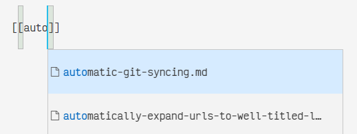
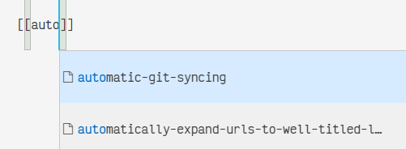

# Link Formatting and Autocompletion

When coming from Roam, Obsidian and such tools, you may be used to writing [[wiki-links]] in `[[Title Case Format]]`. Foam will eventually support this syntax (see: [foambubble/rfcs#3](https://github.com/foambubble/rfcs/pull/3)), but for the time being, we do not.

Foam relies heavily on our [[recommended-extensions]], and each extension has slightly different semantics and edge cases. This is a short guide on how to name your files, format your links, and configure your editor so that you can enjoy Foam until our implementation catches up with our aspirations.

## Short version

- Name your files in `lower-dash-case.md`. 
  - Read on: [How to name your files](#how-to-name-your-files)
- Use [[wiki-links]] that match the file name exactly, without file extension: `[[lower-dash-case]]`
  - Read on: [How to format your links](#how-to-format-your-links)
  - Read on: [How to autocomplete your links correctly](#how-to-autocomplete-your-links-correctly)
- Ensure every file has a `# Heading` element
  - This will be used as your document title.
  
## How to name your files

As described in [[foam-file-format]], **Foam file names should not contain spaces.** Because of the [Markdown Notes](https://marketplace.visualstudio.com/items?itemName=kortina.vscode-markdown-notes) extension's default behaviour, we recommend naming your files in lower-dash-case: `foam-file-format.md`.

ℹ️ This means:
- All lowercase
- No spaces, punctuation or special characters
- Using dashes as word separators
- Ending with a `.md` extension

✅ Valid lower-dash-case file names include:
- `roadmap.md`
- `foam-file-format.md`
- `f-f-f-f-falling.md`

❌ Some invalid names include:

- `Roadmap.md` (Name should not be capitalised)
- `foam file format.md` (Name should not have spaces)
- `f-f-f-f-falling!.md` (Name should not have special characters)

Some of these file names may work for a subset of use cases (for example, if you don't publish your Foam site), but we'd still recommend following these rules.

As per [[foam-file-format]], we eventually want to make Foam a lot more lenient. As per our [[principles]], you should be able to focus on your work and not fight against Foam. We're not there yet, but we'll get there.

## How to format your links

Use [[wiki-links]] to link between files. Each link:
- **Should match file name exactly**: `[[foam-file-format]]`, not `[[Foam File Format]]`
  - If you're reading this document on the Foam website, you might think: "That's not right!" What about links like [[foam-file-format]]! That uses spaces, capitalised letters, and everything!
  - But if you look at the <a href="link-formatting-and-autocompletion.md">raw version of this document</a>, you'll see that the link is actually written as `[[foam-file-format]]`: we make it look nicer with a bit of web magic and a sprinkle of JavaScript.
- **Not include a file extension**: `[[foam-file-format]]`, not `[[foam-file-format.md]]`.
  - You might ask: If I can't use the `.md` extension, why does Foam autocomplete it for me?
  - The answer is: It's a setting. See [How to autocomplete your links correctly](#how-to-autocomplete-your-links-correctly) below.

## How to autocomplete your links correctly

Foam autocompletion is provided by [Markdown Notes](https://marketplace.visualstudio.com/items?itemName=kortina.vscode-markdown-notes). The default behaviour of Markdown Notes Autocomplete is to suffix `.md` to the end of suggestion, such as in the below screenshot:



To change this behaviour, add the below to your `.vscode/settings.json` file:

```json
"vscodeMarkdownNotes.noteCompletionConvention": "noExtension"
```

Now your autocomplete will look like the below screenshot:



If you created your Foam from the official [foam-template](https://github.com/foambubble/foam-template) project after 27th July 2020, this setting should be already correctly set.

[//begin]: # "Autogenerated link references for markdown compatibility"
[wiki-links]: wiki-links "Wiki Links"
[recommended-extensions]: recommended-extensions "Recommended Extensions"
[foam-file-format]: foam-file-format "Foam File Format"
[principles]: principles "Principles"
[//end]: # "Autogenerated link references"