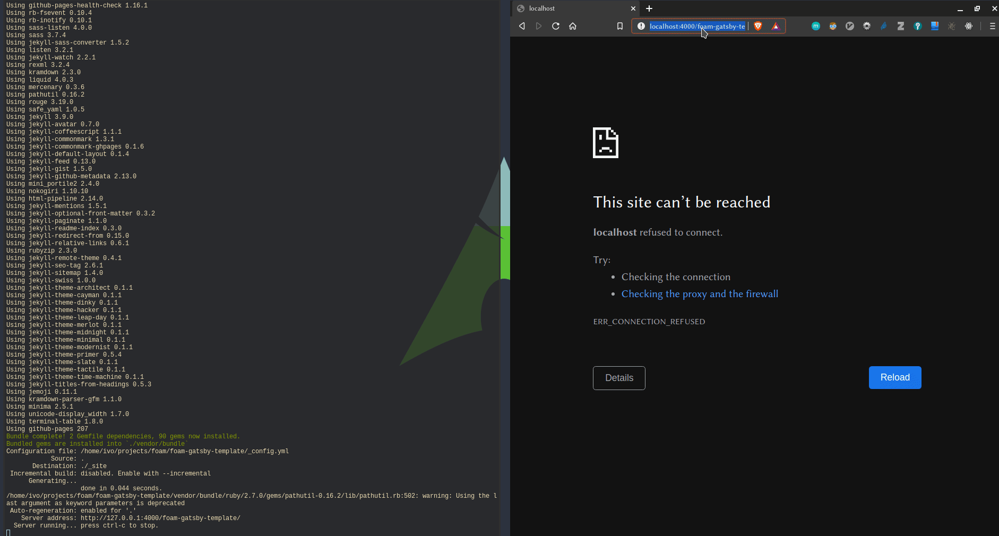

# How To Test Published Foam Sites Locally

By default, [[github-pages]] uses the [Jekyll](https://jekyllrb.com/docs/installation/) static site generator to transform your Markdown files to HTML. If you'd like to build, preview or test the site locally before pushing changes to GitHub, you can run Jekyll on your machine by following this recipe.

! **Disclaimer**: This Recipe is more suited for "tech-savvy" Foam users since it requires the usage of the command line.

## Prerequisites

Github [recommends](https://docs.github.com/en/github/working-with-github-pages/testing-your-github-pages-site-locally-with-jekyll) using Bundler to install and run Jekyll. Bundler manages Ruby gem dependencies, reduces Jekyll build errors, and prevents environment-related bugs.

- Install Ruby (https://www.ruby-lang.org/en/documentation/installation/)
- Install Bundler: `gem install bundler`
- Install Jekyll [following official instructions](https://jekyllrb.com/docs/installation/)

## Instructions

- Open the command line terminal on your machine
- Navigate into your Foam directory
- Initialize Bundler: `bundle init`
- Configure Bundler install path ([optional](https://jekyllrb.com/tutorials/using-jekyll-with-bundler/#configure-bundler-install-path)): `bundle config set --local path 'vendor/bundle'`
- Add the following to your Gemfile:
    ```
    gem "jekyll"
    gem "github-pages"
    ```
- Install the newly added gems: `bundle install`
- Get a jekyll config file [here](https://jekyllrb.com/docs/configuration/default/)
- In the jekyll config set `baseurl` to your Foam folder name
- Finally, build and serve your pages: `bundle exec jekyll serve`
- Enjoy your local foam deploy on: http://localhost:4000/your-folder-name/ (do not forget the trailing '/')

# TL;DR
```
bundle install
bundle exec jekyll serve
```



[//begin]: # "Autogenerated link references for markdown compatibility"
[github-pages]: github-pages "Github Pages"
[//end]: # "Autogenerated link references"
