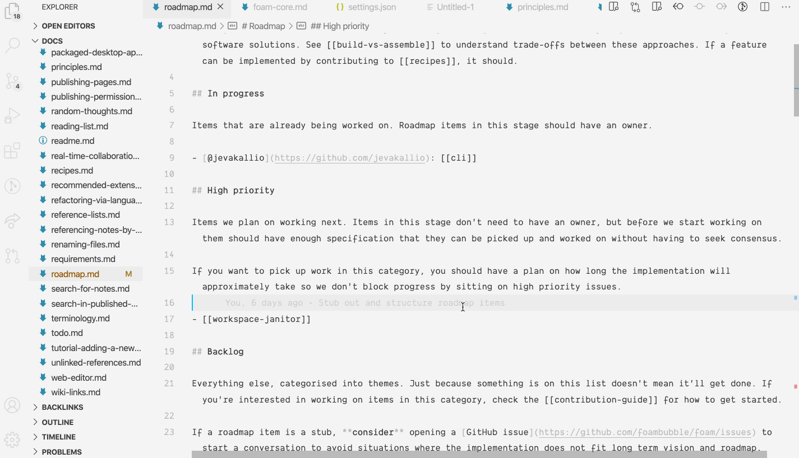

# Make Backlinks More Prominent

One of the most most common early feature requests in Foam is to make the Markdown Notes Backlinks Explorer more prominent.

At the moment, you can drag the explorer pane to your bottom pane, and either show it side by side with another pane, or have take the full width of the editor:

In the future we'll want to improve this feature by

- [[materialized-backlinks]]
- Providing more context around back link reference
  - Could be done by tweaking Markdown Notes slightly. Maybe a user setting?
- Make back links editable using [VS Code Search Editors](https://code.visualstudio.com/updates/v1_43#_search-editors)
  - [Suggested by @Jash on Discord](https://discordapp.com/channels/729975036148056075/729978910363746315/730999992419876956)

[//begin]: # "Autogenerated link references for markdown compatibility"
[materialized-backlinks]: materialized-backlinks "Materialized Backlinks (stub)"
[//end]: # "Autogenerated link references"