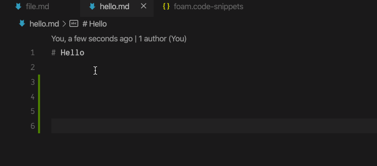
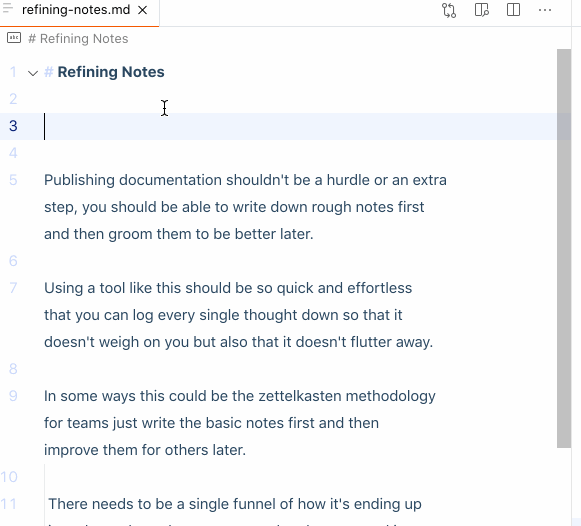

# Pre-defined User Snippets

Having pre-defined user snippets would enable us to introduce Roam style commands to Foam. Consider the below snippets:

```json
{
  "Zettelkasten Id": {
    "scope": "markdown",
    "prefix": "/id",
    "description": "Zettelkasten Id",
    "body": [
      "${CURRENT_YEAR}-${CURRENT_MONTH}-${CURRENT_DATE} ${CURRENT_HOUR}:${CURRENT_MINUTE}:${CURRENT_SECOND}"
    ]
  },
  "Current date": {
    "scope": "markdown",
    "prefix": "/date",
    "description": "Current date",
    "body": [
      "${CURRENT_YEAR}-${CURRENT_MONTH}-${CURRENT_DATE} ${CURRENT_HOUR}:${CURRENT_MINUTE}:${CURRENT_SECOND}"
    ]
  }
}
```

Which would look like:


Using snippets enables Foam users to add [[custom-snippets]] themselves so they live alongside the first-class `/commands`.

## Notes & Considerations

- VS Code supplies "commands" already via the command palette
  - Consider the UX around this. Users less familiar with VS Code are more likely to be familiar with `/` to trigger a command menu. Experienced VS Code users may be more likely to favour the command palette.
- We can use `TabCompletionProvider` and `snippets` and mix them (maybe) via the following VS Code setting: `"editor.snippetSuggestions": "inline" | "top" | "bottom" | "none"`
- For more discussion, consult the PR [here](https://github.com/foambubble/foam/pull/192).

## Simplifying Markdown Syntax

Some markdown syntax is difficult for users who have never authored markdown before. Take for example a checkbox/todo. The following syntax is required:

```
- [ ] Something todo...
```

We could provide snippets that expand out into the associated markdown syntax, like in the below GIF:


The JSON for these snippets can be found [here](https://github.com/foambubble/foam/pull/192#issuecomment-666736270).

[//begin]: # 'Autogenerated link references for markdown compatibility'
[custom-snippets]: custom-snippets 'Adding Custom Snippets'
[//end]: # 'Autogenerated link references'
[//begin]: # 'Autogenerated link references for markdown compatibility'
[custom-snippets]: custom-snippets 'Adding Custom Snippets'
[//end]: # 'Autogenerated link references'
[//begin]: # 'Autogenerated link references for markdown compatibility'
[custom-snippets]: custom-snippets 'Adding Custom Snippets'
[//end]: # 'Autogenerated link references'
