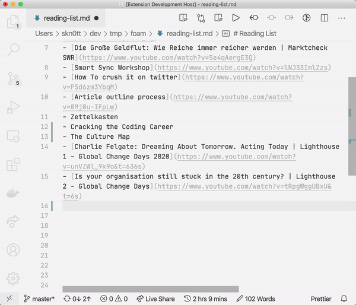

# How to easily prettify links

We all like to add links to our notes.
But a lot of the time, plain URLs aren't very readable and it's tedious to add a nice title.
This recipe explains how to automate this.

## Required Extensions

 - [Markdown Link Expander](https://marketplace.visualstudio.com/items?itemName=skn0tt.markdown-link-expander)

Markdown Link Expander will scrape your URL's `<title>` tag to create a nice Markdown-style link.

## Instructions

1. Highlight desired URL
2. `Cmd` + `Shift` + `P`
3. `Expand URL to Markdown`
4. Profit

That's pretty much it!

Have an idea for the extension? [Feel free to share! 🎉](https://github.com/Skn0tt/markdown-link-expander/issues)

[//begin]: # "Autogenerated link references for markdown compatibility"
[recommended-extensions]: recommended-extensions "Recommended Extensions"
[recipes]: recipes "Recipes"
[contribution-guide]: contribution-guide "Contribution Guide"
[//end]: # "Autogenerated link references"