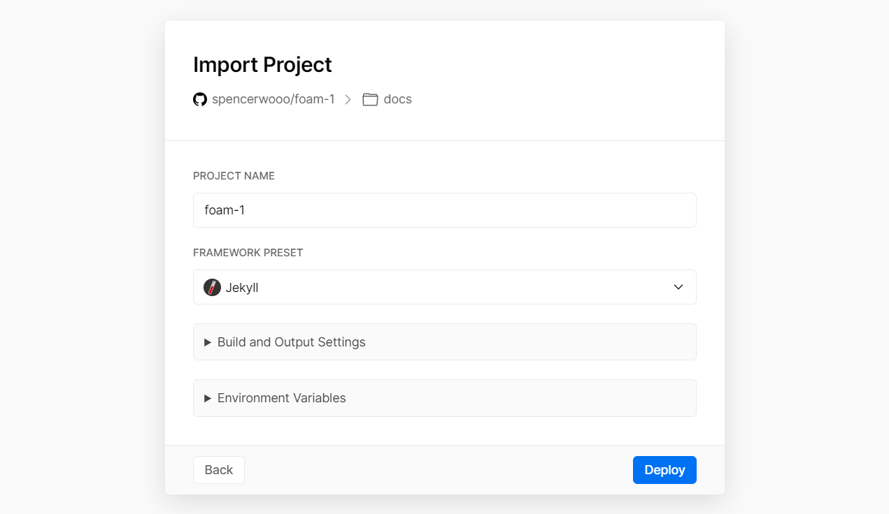

# Publish to Vercel

This #recipe shows you how to deploy the default Foam website template to Vercel.

[Vercel](https://vercel.com/) is a static website hosting solution similar to GitHub Pages (see [[publish-to-github-pages]]).

## Setting up the project

### Using Foam's template

Generate a GitHub repository using the default [Foam template](https://github.com/foambubble/foam-template), this will be the workspace that we will be deploying with Vercel. This workspace is a barebone Jekyll source website, which means we can customize and install plugins just like any other Jekyll websites.

As we won't be using GitHub Pages, we will be adding a few configuration files in order to help Vercel pick up on how to build our site.

### Adding a `_config.yml`

First, we'll need to add a `_config.yml` at the root directory. This is the Jekyll configuration file. In here, we will set the site's title, theme, repository and permalink options, and also tell Jekyll what plugins to use:

```yaml
# _config.yml
title: Foam
# All the plugins we will be installing now that we won't be using GitHub Pages
plugins:
  - jekyll-katex  # optional
  - jekyll-default-layout
  - jekyll-relative-links
  - jekyll-readme-index
  - jekyll-titles-from-headings
  - jekyll-optional-front-matter
# The default Jekyll theme we will be using
theme: jekyll-theme-primer
# The GitHub repository that we are hosting our foam workspace from
repository: user/repo
# Generate permalinks in format specified in: https://jekyllrb.com/docs/permalinks/#built-in-formats
permalink: pretty
```

The `theme` specifies a theme for our deployed Jekyll website. The default GitHub Pages template is called [Primer](https://github.com/pages-themes/primer). See Primer docs for how to customise html layouts and templates. We can also choose a theme if you want from places like [Jekyll Themes](https://jekyllthemes.io/).

The `plugins` specifies a list of Jekyll plugins that we will be installing in the next section. As we won't be using GitHub Pages, we'll need to install these plugins that GitHub Pages installs for us under the hood.

_If you want to use LaTeX rendered with KaTeX (which is what the plugin `jekyll-katex` does), you can specify it here. And yes, one of the benefits of deploying with Vercel is that we can use KaTeX to render LaTeX! More on: [[math-support-with-katex]]_

### Adding a `Gemfile`

Next up, we'll create another new file called `Gemfile` in the root directory. This is where we will let Vercel know what plugins to install when building our website.

In our `Gemfile`, we need to specify our Ruby packages:

```ruby
# Gemfile
source "https://rubygems.org"
gem "jekyll"
gem "kramdown-parser-gfm"
gem "jekyll-theme-primer"
gem "jekyll-optional-front-matter"
gem "jekyll-default-layout"
gem "jekyll-relative-links"
gem "jekyll-readme-index"
gem "jekyll-titles-from-headings"
gem "jekyll-katex"  # Optional, the package that enables KaTeX math rendering
```

### Enable math rendering with KaTeX (optional)

Besides adding the plugin `jekyll-katex` in `_config.yml` and `Gemfile`, we'll also have to follow the guides in [[math-support-with-katex]] to let our site fully support using KaTeX to render math equations.

### Commiting changes to GitHub repo

Finally, commit the newly created files to GitHub.

## Importing project to Vercel

First, import our foam workspace (GitHub repository) to Vercel with [Vercel's _Import Git Repository_](https://vercel.com/import/git). Paste our GitHub repo's url and Vercel will automatically pull and analyze the tool we use to deploy our website. (In our case: Jekyll.)

Next, select the folder to deploy from if prompted. If we are using the default template, then Vercel will default to the root directory of our Foam workspace.

Finally, if all is successful, Vercel will show the detected framework: Jekyll. Press `Deploy` to proceed on publishing our project.



And now, Vercel will take care of building and rendering our foam workspace each time on push. Vercel will publish our site to `xxx.vercel.app`, we can also define a custom domain name for our Vercel website.

[//begin]: # "Autogenerated link references for markdown compatibility"
[publish-to-github-pages]: publish-to-github-pages.md "Github Pages"
[math-support-with-katex]: math-support-with-katex.md "Katex Math Rendering"
[//end]: # "Autogenerated link references"
