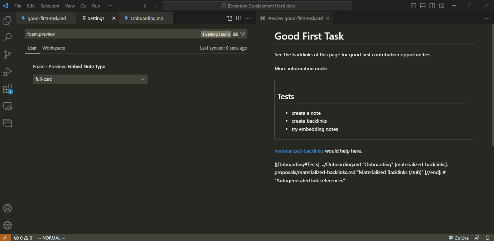

# Built-In Note Embedding Types

When embedding a note, there are a few ways to modify the scope of the content as well as its display style. The following are Foam keywords that are used to describe note embedding.

Note, this only applies to note embedding, not embedding of attachments or images.

## Scope

- `full` - the entire note in the case of `![[note]]` or the entire section in the case of `![[note#section1]]`
- `content` - everything excluding the title of the section. So the entire note minus the title for `![[note]]`, or the entire section minus the section header for `![[note#section1]]`

## Style

- `card` - outlines the embedded note with a border
- `inline` - adds the note continuously as if the text were part of the calling note

## Default Setting

Foam expresses note display type as `<scope>-<style>`.

By default, Foam configures note embedding to be `full-card`. That is, whenever the standard embedding syntax is used, `![[note]]`, the note will have `full` scope and `card` style display. This setting is stored under `foam.preview.embedNoteStyle` and can be modified.

## Explicit Modifiers

Prepend the wikilink with one of the scope or style keywords, or a combination of the two to explicitly modify a note embedding if you would like to override the default setting.

For example, given your `foam.embedNoteStyle` is set to `content-card`, embedding a note with standard syntax `![[note-a]]` would show a bordered note without its title. Say, for a specific `note-b` you would like to display the title. You can simply use one of the above keywords to override your default setting like so: `full![[note-b]]`. In this case, `full` overrides the default `content` scope and because a style is not specified, it falls back to the default style setting, `card`. If you would like it to be inline, override that as well: `full-inline![[note-b]]`.
