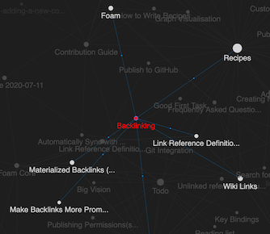

# Graph Visualization

Foam comes with a graph visualization of your notes.
To see the graph execute the `Foam: Show Graph` command.

## Graph Navigation

With the graph you can:

- highlight a node by hovering on it, to quickly see how it's connected to the rest of your notes
- select one or more (by keeping `shift` pressed while selecting) nodes by clicking on them, to better understand the structure of your notes
- navigate to a note by clicking on it while pressing `ctrl` or `cmd`
- automatically center the graph on the currently edited note, to immediately see its connections

## Custom Graph Styles

The Foam graph will use the current VS Code theme by default, but it's possible to customize it with the `foam.graph.style` setting.


A sample configuration object is provided below, you can provide as many or as little configuration as you wish:

```json
"foam.graph.style": {
    "background": "#202020",
    "fontSize": 12,
    "highlightedForeground": "#f9c74f",
    "node": {
        "note": "#277da1",
        "placeholder": "#545454",
    }
}
```

- `background`, `fontSize`, and `highlightedForeground` are properties associated with the overall graph that is displayed
- to style individual types of nodes see [Style Nodes By Type](#style-nodes-by-type)

### Style Nodes by Type

It is possible to customize the style of a node based on the `type` property in the YAML frontmatter of the corresponding document.

There are a few default node types defined by Foam that are displayed in the graph:

- `note` defines the color for regular nodes whose documents have not overriden the `type` property
- `placeholder` defines the color for links that don't match any existing note. This is a [[placeholder]] because no file with such name exists (see [[wikilinks]] for more info). <!--NOTE: this placeholder link should NOT have an associated file. This is to demonstrate the custom coloring-->
  - see [[note-properties]] for details

For example the following `backlinking.md` note:

```markdown
---
type: feature
---
# Backlinking

...
```

And the following `settings.json`:

```json
"foam.graph.style": {
    "node": {
        "feature": "red",
    }
}
```

Will result in the following graph:




