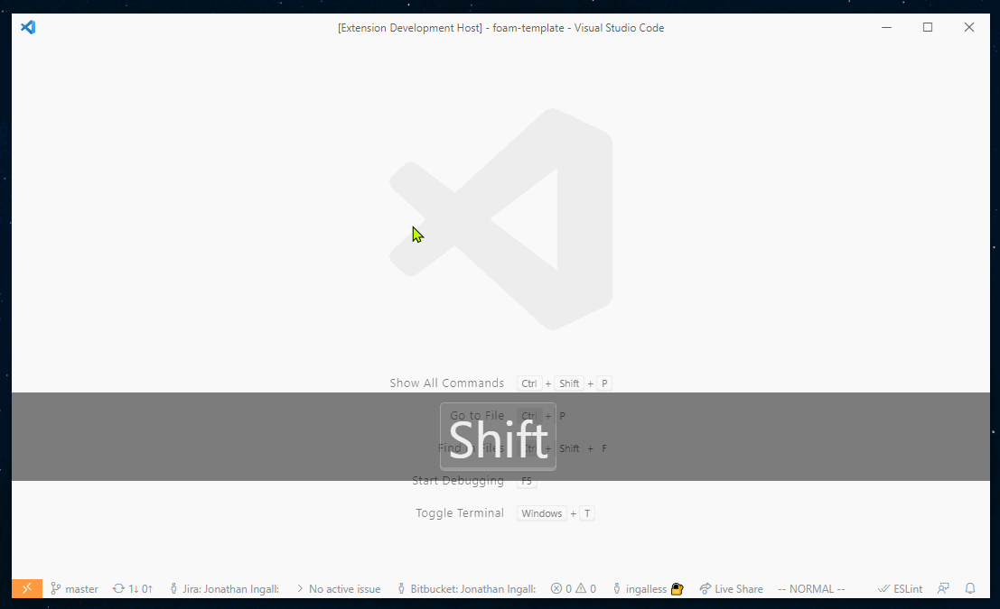
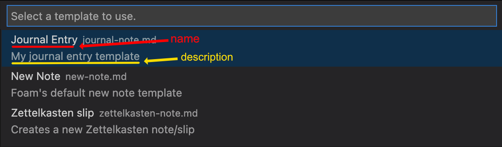

# Note Templates

Foam supports note templates which let you customize the starting content of your notes instead of always starting from an empty note.

Foam supports two types of templates:

- **Markdown templates** (`.md` files) - Simple templates with predefined content and variables
- **JavaScript templates** (`.js` files) - Smart templates that can adapt based on context and make intelligent decisions

Both types of templates are located in the special `.foam/templates` directory of your workspace.

## Quickstart

### Creating templates

**For simple templates:**

- Run the `Foam: Create New Template` command from the command palette
- OR manually create a regular `.md` file in the `.foam/templates` directory

**For smart templates:**

- Create a `.js` file in the `.foam/templates` directory (see [JavaScript Templates](#javascript-templates) section below)


### Using templates

To create a note from a template:

- Run the `Foam: Create New Note From Template` command and follow the instructions. Don't worry if you've not created a template yet! You'll be prompted to create a new simple template if none exist.
- OR run the `Foam: Create New Note` command, which uses the special default template (`.foam/templates/new-note.md` or `.foam/templates/new-note.js`, if it exists)



## Special templates

### Default template

The default template is used by the `Foam: Create New Note` command. Foam will look for these templates in order:

1. `.foam/templates/new-note.js` (JavaScript template)
2. `.foam/templates/new-note.md` (Markdown template)

Customize this template to contain content that you want included every time you create a note.

### Default daily note template

The daily note template is used when creating daily notes (e.g. by using `Foam: Open Daily Note`). Foam will look for these templates in order:

1. `.foam/templates/daily-note.js` (JavaScript template)
2. `.foam/templates/daily-note.md` (Markdown template)

You can also configure a custom daily note template path in your VS Code settings:

```json
{
  "foam.openDailyNote.templatePath": ".foam/templates/my-daily-template.js"
}
```

For a simple markdown template, it is _recommended_ to define the YAML Front-Matter similar to the following:

```markdown
---
type: daily-note
---
```

## Markdown templates

Markdown templates are a simple way to notes

**Use Markdown templates when you want to:**

- Create simple, consistent note structures
- Use basic variables and placeholders
- Keep templates easy to read and modify

### Variables

Markdown templates can use all the variables available in [VS Code Snippets](https://code.visualstudio.com/docs/editor/userdefinedsnippets#_variables).

In addition, you can also use variables provided by Foam:

| Name                 | Description                                                                                                                                                                                                                                  |
| -------------------- | -------------------------------------------------------------------------------------------------------------------------------------------------------------------------------------------------------------------------------------------- |
| `FOAM_SELECTED_TEXT` | Foam will fill it with selected text when creating a new note, if any text is selected. Selected text will be replaced with a wikilink to the new                                                                                            |
| `FOAM_TITLE`         | The title of the note. If used, Foam will prompt you to enter a title for the note.                                                                                                                                                          |
| `FOAM_TITLE_SAFE`    | The title of the note in a file system safe format. If used, Foam will prompt you to enter a title for the note unless `FOAM_TITLE` has already caused the prompt.                                                                           |
| `FOAM_SLUG`          | The sluggified title of the note (using the default github slug method). If used, Foam will prompt you to enter a title for the note unless `FOAM_TITLE` has already caused the prompt.                                                      |
| `FOAM_DATE_*`        | `FOAM_DATE_YEAR`, `FOAM_DATE_MONTH`, `FOAM_DATE_WEEK` etc. Foam-specific versions of [VS Code's datetime snippet variables](https://code.visualstudio.com/docs/editor/userdefinedsnippets#_variables). Prefer these versions over VS Code's. |

### `FOAM_DATE_*` variables

Foam defines its own set of datetime variables that have a similar behaviour as [VS Code's datetime snippet variables](https://code.visualstudio.com/docs/editor/userdefinedsnippets#_variables).

For example, `FOAM_DATE_YEAR` has the same behaviour as VS Code's `CURRENT_YEAR`, `FOAM_DATE_SECONDS_UNIX` has the same behaviour as `CURRENT_SECONDS_UNIX`, etc.

By default, prefer using the `FOAM_DATE_` versions. The datetime used to compute the values will be the same for both `FOAM_DATE_` and VS Code's variables, with the exception of the creation notes using the daily note template.

For more nitty-gritty details about the supported date formats, [see here](https://github.com/foambubble/foam/blob/main/packages/foam-vscode/src/services/variable-resolver.ts).

#### Relative daily notes

When referring to daily notes, you can use the relative snippets (`/+1d`, `/tomorrow`, etc.). In these cases, the new notes will be created with the daily note template, but the datetime used should be the relative datetime, not the current datetime.
By using the `FOAM_DATE_` versions of the variables, the correct relative date will populate the variables, instead of the current datetime.

For example, given this daily note template (`.foam/templates/daily-note.md`):

```markdown
# $FOAM_DATE_YEAR-$FOAM_DATE_MONTH-$FOAM_DATE_DATE

## Here's what I'm going to do today

- Thing 1
- Thing 2
```

When the `/tomorrow` snippet is used, `FOAM_DATE_` variables will be populated with tomorrow's date, as expected.
If instead you were to use the VS Code versions of these variables, they would be populated with today's date, not tomorrow's, causing unexpected behaviour.

When creating notes in any other scenario, the `FOAM_DATE_` values are computed using the same datetime as the VS Code ones, so the `FOAM_DATE_` versions can be used in all scenarios by default.

## JavaScript Templates

JavaScript templates are a powerful way to create smart, context-aware note templates that can adapt based on the situation. Unlike static Markdown templates, JavaScript templates can make intelligent decisions about what content to include.

**Use JavaScript templates when you want to:**

- Create different note structures based on the day of the week, time, or date
- Adapt templates based on where the note is being created from
- Automatically find and link related notes in your workspace
- Generate content based on existing notes or workspace structure
- Implement complex logic that static templates cannot handle

### Basic JavaScript template structure

A JavaScript template is a `.js` file that exports a function returning note content, and optionally location:

```javascript
// .foam/templates/smart-daily.js
module.exports = async context => {
  const { formatDate, getWeekday } = context.utils;
  const today = new Date();
  const dayName = getWeekday(today);

  if (dayName === 'Monday') {
    return {
      content: `# Week Planning - ${formatDate(today, 'yyyy-MM-dd')}

## This week's goals
- [ ] Goal 1
- [ ] Goal 2

## Focus areas
- 
`,
      filepath: `weekly-planning/${formatDate(today, 'yyyy-MM-dd')}.md`,
    };
  } else if (dayName === 'Friday') {
    return {
      content: `# Week Review - ${formatDate(today, 'yyyy-MM-dd')}

## What went well
- 

## What could be improved
- 

## Next week's priorities
- 
`,
    };
  } else {
    return {
      content: `# Daily Note - ${formatDate(today, 'yyyy-MM-dd')}

## Today's focus
- 

## Notes
- 
`,
    };
  }
};
```

### Template context

JavaScript templates receive a context object with information about how the note is being created:

```javascript
function createNote(context) {
  return {
    content: 'hello world',
    filepath: 'hello-world.md',
  };
}
```

### Examples

**Smart meeting notes:**

```javascript
function createNote(context) {
  const { formatDate } = context.utils;
  const title = context.variables.FOAM_TITLE || 'Meeting';

  // Detect meeting type from title
  const isStandup = title.toLowerCase().includes('standup');
  const isReview = title.toLowerCase().includes('review');

  let template = `# ${title} - ${formatDate(context.date, 'yyyy-MM-dd')}

`;

  if (isStandup) {
    template += `## What I did yesterday
- 

## What I'm doing today
- 

## Blockers
- 
`;
  } else if (isReview) {
    template += `## What went well
- 

## What could be improved
- 

## Action items
- [ ] 
`;
  } else {
    template += `## Agenda
- 

## Notes
- 

## Action items
- [ ] 
`;
  }

  return {
    content: template,
    filepath: XYZ,
  };
}
```

**Project-aware notes:**

```javascript
module.exports = async context => {
  const { foamWorkspace } = context;

  // Find project notes in the workspace
  const projectNotes = foamWorkspace.find(
    uri => uri.path.includes('/projects/') && uri.path.endsWith('.md')
  );

  let content = `# ${context.variables.FOAM_TITLE || 'New Note'}

`;

  if (projectNotes.length > 0) {
    content += `## Related projects
`;
    projectNotes.slice(0, 5).forEach(note => {
      const title = note.title || note.basename;
      content += `- [[${title}]]\n`;
    });
    content += `\n`;
  }

  content += `## Notes
- 
`;

  return {
    content,
    filepath: XYZ,
  };
};
```

### Template result format

JavaScript templates must return an object with:

- `content` (required): The note content as a string
- `filepath` (required): Custom file path for the note

```javascript
return {
  content: '# My Note\n\nContent here...',
  filepath: 'custom-folder/my-note.md',
};
```

### Available utilities

JavaScript templates have access to these utility functions:

| Function                        | Description                         | Example                                                    |
| ------------------------------- | ----------------------------------- | ---------------------------------------------------------- |
| `formatDate(date, format)`      | Format dates using various patterns | `formatDate(new Date(), 'yyyy-MM-dd')`                     |
| `getWeekday(date)`              | Get the day of the week             | `getWeekday(new Date())` returns `'Monday'`                |
| `slugify(text)`                 | Convert text to URL-friendly format | `slugify('My Note Title')` returns `'my-note-title'`       |
| `expandTemplate(path, context)` | Use an existing template            | `await expandTemplate('.foam/templates/base.md', context)` |

### Security and limitations

JavaScript templates run in a best-effort secured environment:

- ✅ Can only run from trusted VS Code workspaces
- ✅ Can access Foam workspace and utilities
- ✅ Can use standard JavaScript features
- ✅ Have a 30-second execution timeout
- ❌ Cannot access the file system directly
- ❌ Cannot make network requests
- ❌ Cannot access Node.js modules

This increases the chances that templates stay safe while still being powerful enough for complex logic.

**STILL - PLEASE BE AWARE YOU ARE EXECUTING CODE ON YOUR MACHINE. YOU MUST TRUST THE REPO CONTRIBUTORS**

## Metadata

Markdown templates can also contain metadata about the templates themselves. The metadata is defined in YAML "Frontmatter" blocks within the templates.

| Name          | Description                                                                                                                      |
| ------------- | -------------------------------------------------------------------------------------------------------------------------------- |
| `filepath`    | The filepath to use when creating the new note. If the filepath is a relative filepath, it is relative to the current workspace. |
| `name`        | A human readable name to show in the template picker.                                                                            |
| `description` | A human readable description to show in the template picker.                                                                     |

Foam-specific variables (e.g. `$FOAM_TITLE`) can be used within template metadata. However, VS Code snippet variables are ([currently](https://github.com/foambubble/foam/pull/655)) not supported.

### `filepath` attribute

The `filepath` metadata attribute allows you to define a relative or absolute filepath to use when creating a note using the template. If the filepath is a relative filepath, it is relative to the current workspace.

#### Example of **relative** `filepath`

For example, `filepath` can be used to customize `.foam/templates/new-note.md`, overriding the default `Foam: Create New Note` behaviour of opening the file in the same directory as the active file:

```yaml
---
# This will create the note in the "journal" subdirectory of the current workspace,
# regardless of which file is the active file.
foam_template:
  filepath: 'journal/$FOAM_TITLE.md'
---
```

#### Example of **absolute** `filepath`

`filepath` can be an absolute filepath, so that the notes get created in the same location, regardless of which file or workspace the editor currently has open.
The format of an absolute filepath may vary depending on the filesystem used.

```yaml
---
foam_template:
  # Unix / MacOS filesystems
  filepath: '/Users/john.smith/foam/journal/$FOAM_TITLE.md'

  # Windows filesystems
  filepath: 'C:\Users\john.smith\Documents\foam\journal\$FOAM_TITLE.md'
---
```

#### Example of **date-based** `filepath`

It is possible to vary the `filepath` value based on the current date using the `FOAM_DATE_*` variables. This is especially useful for the [[daily-notes]] template if you wish to organize by years, months, etc. Below is an example of a daily-note template metadata section that will create new daily notes under the `journal/YEAR/MONTH-MONTH_NAME/` filepath. For example, when a note is created on November 15, 2022, a new file will be created at `C:\Users\foam_user\foam_notes\journal\2022\11-Nov\2022-11-15-daily-note.md`. This method also respects the creation of daily notes relative to the current date (i.e. `/+1d`).

```markdown
---
type: daily-note
foam_template:
  description: Daily Note for $FOAM_TITLE
  filepath: "C:\\Users\\foam_user\\foam_notes\\journal\\$FOAM_DATE_YEAR\\$FOAM_DATE_MONTH-$FOAM_DATE_MONTH_NAME_SHORT\\$FOAM_DATE_YEAR-$FOAM_DATE_MONTH-$FOAM_DATE_DATE-daily-note.md"
---

# $FOAM_DATE_YEAR-$FOAM_DATE_MONTH-$FOAM_DATE_DATE Daily Notes
```

> Note: this method **requires** the use of absolute file paths, and in this example is using Windows path conventions. This method will also override any filename formatting defined in `.vscode/settings.json`

### `name` and `description` attributes

These attributes provide a human readable name and description to be shown in the template picker (e.g. When a user uses the `Foam: Create New Note From Template` command):



### Adding template metadata to an existing YAML Frontmatter block

If your template already has a YAML Frontmatter block, you can add the Foam template metadata to it.

#### Limitations

Foam only supports adding the template metadata to _YAML_ Frontmatter blocks. If the existing Frontmatter block uses some other format (e.g. JSON), you will have to add the template metadata to its own YAML Frontmatter block.

Further, the template metadata must be provided as a [YAML block mapping](https://yaml.org/spec/1.2/spec.html#id2798057), with the attributes placed on the lines immediately following the `foam_template` line:

```yaml
---
existing_frontmatter: "Existing Frontmatter block"
foam_template: # this is a YAML "Block" mapping ("Flow" mappings aren't supported)
  name: My Note Template # Attributes must be on the lines immediately following `foam_template`
  description: This is my note template
  filepath: `journal/$FOAM_TITLE.md`
---
This is the rest of the template
```

### Adding template metadata to its own YAML Frontmatter block

You can add the template metadata to its own YAML Frontmatter block at the start of the template:

```yaml
---
foam_template:
  name: My Note Template
  description: This is my note template
  filepath: 'journal/$FOAM_TITLE.md'
---
This is the rest of the template
```

If the note already has a Frontmatter block, a Foam-specific Frontmatter block can be added to the start of the template. The Foam-specific Frontmatter block must always be placed at the very beginning of the file, and only whitespace can separate the two Frontmatter blocks.

```yaml
---
foam_template:
  name: My Note Template
  description: This is my note template
  filepath: 'journal/$FOAM_TITLE.md'
---

---
existing_frontmatter: 'Existing Frontmatter block'
---
This is the rest of the template
```

[//begin]: # "Autogenerated link references for markdown compatibility"
[daily-notes]: daily-notes.md "Daily Notes"
[//end]: # "Autogenerated link references"
