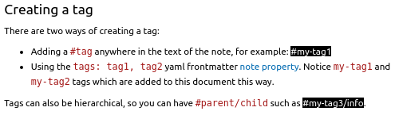

# Tags

You can add tags to your notes to categorize or link notes together.

## Creating a tag

There are two ways of creating a tag:

- Adding a `#tag` anywhere in the text of the note, for example: #my-tag1
- Using the `tags: tag1, tag2` yaml frontmatter [[note-properties|note property]]. Notice `my-tag1` and `my-tag2` tags which are added to this document this way.

Tags can also be hierarchical, so you can have `#parent/child` such as #my-tag3/info.

## Using *Tag Explorer*

It's possible to navigate tags via the Tag Explorer panel. Expand the Tag Explorer view in the left side bar which will list all the tags found in current Foam environment. Then, each level of tags can be expanded until the options to search by tag and a list of all files containing a particular tag are shown.

Tags can also be visualized in the Foam Graph Explorer. See [[graph-visualization]] for more info including how to change the color of nodes representing tags.

## Styling tags

It is possible to customize the way that tags look in the Markdown Preview panel that renders your Foam notes. This requires some knowledge of the CSS language, which is used to customize the styles of web technologies such as VSCode. A cursory introduction to CSS can be [found here](https://www.freecodecamp.org/news/get-started-with-css-in-5-minutes-e0804813fc3e/).

1. Create a CSS file within your Foam project, for example in `.foam/css/custom-tag-style.css` or [.vscode/custom-tag-style.css](../../.vscode/custom-tag-style.css)
2. Add CSS code that targets the `.foam-tag` class
3. Add a rule for each [CSS property](https://www.w3schools.com/cssref/index.php) you would like applied to your tags.
4. Open the `.vscode/settings.json` file (or the Settings browser with `ctrl+,`)
5. Add the path to your new stylesheet to the `markdown.styles` setting.

> Note: the file path for the stylesheet will be relative to the currently open folder in the workspace when changing this setting for the current workspace. If changing this setting for the user, then the file path will be relative to your global [VSCode settings](https://code.visualstudio.com/docs/getstarted/settings).

The end result will be a CSS file that looks similiar to the content below. Now you can make your tags standout in your note previews.

```css
.foam-tag{
  color:#ffffff;
  background-color: #000000;
}
```



## Using backlinks in place of tags

Given the power of backlinks, some people prefer to use them as tags.
For example you can tag your notes about books with [[book]].

[//begin]: # "Autogenerated link references for markdown compatibility"
[note-properties|note property]: note-properties.md "Note Properties"
[graph-visualization]: graph-visualization.md "Graph Visualization"
[//end]: # "Autogenerated link references"
