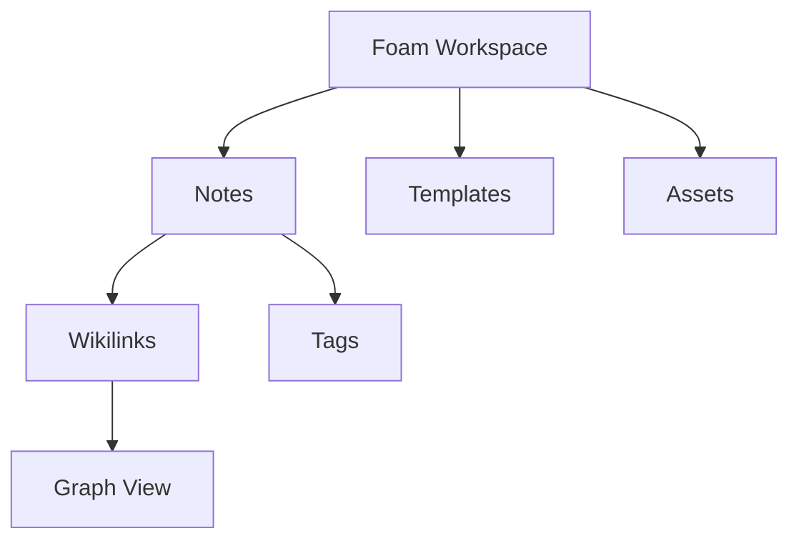

# Using Foam with VS Code Features

Foam builds on Visual Studio Code's powerful editing capabilities, integrating seamlessly with VS Code's native features to create a comprehensive knowledge management experience. This guide explores how to leverage VS Code's built-in functionality alongside Foam.

### Keyboard shortcuts

VS Code supports various **keyboard shortcuts**, the most important for us are:

| Shortcut      | Action                        |
| ------------- | ----------------------------- |
| `cmd+N`       | create a new file             |
| `cmd+S`       | save the current file         |
| `cmd+O`       | open a file                   |
| `cmd+P`       | use quickpick to open a file  |
| `alt+D`       | open the daily note for today |
| `alt+H`       | open the daily note for a day |
| `cmd+shift+P` | invoke a command (see below)  |

For more information, see the [VS Code keyboard cheat sheets](https://code.visualstudio.com/docs/getstarted/keybindings#_keyboard-shortcuts-reference), where you can also see how to customize your keybindings.

### Commands

Commands make VS Code extremely powerful.

To invoke a command, press `cmd+shift+P` and select the command you want to execute.
For example, to see the Foam graph:

- press `cmd+shift+P` to open the command bar
- start typing `show graph`
- select the `Foam: Show Graph` command

And watch the magic unfold.

To see all foam commands, type "foam" in the command bar.
For more information on commands, see [commands on the VS Code site](https://code.visualstudio.com/docs/getstarted/userinterface#_command-palette).

If you want to learn more about VS Code, check out their [website](https://code.visualstudio.com/docs#first-steps).

### Panels

Foam integrates with VS Code panels to provide insights into individual notes and the whole knowledge base.

- **`Foam: links`**: Shows all notes that link to and from the currently active note, helping you understand connections and navigate your knowledge graph
- **`Foam: Orphaned Notes`**: Displays notes that have no incoming or outgoing links, helping you identify isolated content that might need better integration
- **`Tag Explorer`**: Shows all tags used across your workspace in a hierarchical view, see [[tags]] for more information on tags
- **`Foam: Graph`**: Visual representation of your note connections (also available as a separate graph view)

### Styling and Themes

VS Code is very configurable when it comes to themes and style. Find your ideal set up by running the command `Color Theme`.
For more information see the [VS Code documentation](https://code.visualstudio.com/docs/configure/themes).

### Multi-Cursor Editing

Edit multiple locations simultaneously for efficient note management:

**Basic Multi-Cursor:**

- `Alt+Click` / `Option+Click` - Add cursor at click location
- `Ctrl+Alt+Down` / `Cmd+Option+Down` - Add cursor below
- `Ctrl+Alt+Up` / `Cmd+Option+Up` - Add cursor above
- `Ctrl+D` / `Cmd+D` - Select next occurrence of word
- `Ctrl+Shift+L` / `Cmd+Shift+L` - Select all occurrences

**Bulk wikilink creation:**

1. **Select a word** (e.g., "Python")
2. **Press `Ctrl+Shift+L`** to select all occurrences
3. **Type `[[]]`** to wrap all instances
4. **Arrow key** to position cursor inside brackets

### Find and Replace

Powerful search and replace for note maintenance:

**Basic Find/Replace:**

- `Ctrl+F` / `Cmd+F` - Find in current file
- `Ctrl+H` / `Cmd+H` - Replace in current file
- `Ctrl+Shift+F` / `Cmd+Shift+F` - Find across workspace
- `Ctrl+Shift+H` / `Cmd+Shift+H` - Replace across workspace

### Text Folding

Organize long notes with collapsible sections:

**Folding Controls:**

- **Click fold icons** in the gutter next to headings
- `Ctrl+Shift+[` / `Cmd+Option+[` - Fold current section
- `Ctrl+Shift+]` / `Cmd+Option+]` - Unfold current section
- `Ctrl+K Ctrl+0` / `Cmd+K Cmd+0` - Fold all
- `Ctrl+K Ctrl+J` / `Cmd+K Cmd+J` - Unfold all

## File Management

### Explorer Integration

Leverage VS Code's file explorer for note organization:

**File Operations:**

- **Drag and drop** files to reorganize
- **Right-click context menus** for quick actions
- **New file/folder** creation with shortcuts
- **Bulk selection** with Ctrl+Click / Cmd+Click

**Quick File Actions:**

- `F2` - Rename file (Foam updates links automatically)
- `Delete` - Move to trash
- `Ctrl+C` / `Cmd+C` then `Ctrl+V` / `Cmd+V` - Copy/paste files
- **Right-click → Reveal in Explorer/Finder** - Open in file system

### Quick Open

Rapid file navigation for large knowledge bases:

**Quick Open Commands:**

- `Ctrl+P` / `Cmd+P` - Go to file
- `Ctrl+Shift+O` / `Cmd+Shift+O` - Go to symbol (headings in Markdown)
- `Ctrl+T` / `Cmd+T` - Go to symbol in workspace
- `Ctrl+G` / `Cmd+G` - Go to line number

**Search Patterns:**

```
# Go to File (Ctrl+P)
machine       # Finds "machine-learning.md"
proj alpha    # Finds "project-alpha.md"
daily/2025    # Finds files in daily/2025 folder

# Go to Symbol (Ctrl+Shift+O)
@introduction # Jump to "Introduction" heading
@#setup       # Jump to "Setup" heading
:50           # Go to line 50
```

## Search and Discovery

### Global Search

Find content across your entire knowledge base:

**Search Interface (`Ctrl+Shift+F` / `Cmd+Shift+F`):**

- **Search box** - Enter your query
- **Replace box** - Toggle with replace arrow
- **Include/Exclude patterns** - Filter by file types or folders
- **Match case** - Case-sensitive search
- **Match whole word** - Exact word matching
- **Use regular expression** - Advanced pattern matching

### Timeline View

Track changes to your notes over time:

**Accessing Timeline:**

1. **Open Explorer panel**
2. **Expand "Timeline" section** at bottom
3. **Select a file** to see its change history
4. **Click timeline entries** to see diff views

**Timeline Features:**

- **Git commits** show when notes were changed
- **File saves** track editing sessions
- **Diff views** highlight what changed
- **Restore points** for recovering previous versions

### Outline View

Navigate long notes with hierarchical structure:

**Outline Panel:**

1. **Enable in Explorer** (expand "Outline" section)
2. **Shows heading hierarchy** for current note
3. **Click headings** to jump to sections
4. **Collapse/expand** sections in outline

## Version Control Integration

### Git Integration

Track changes to your knowledge base:

**Source Control Panel:**

- **View changes** - See modified files
- **Stage changes** - Click `+` to stage files
- **Commit changes** - Enter message and commit
- **Sync changes** - Push/pull from remote

**Git Workflow for Notes:**

1. **Write and edit** your notes
2. **Review changes** in Source Control panel
3. **Stage relevant files** for commit
4. **Write meaningful commit message**
5. **Commit and push** to backup/share

**Useful Git Features:**

- **Diff view** - See exactly what changed
- **File history** - Track note evolution over time
- **Branch management** - Experiment with different organization approaches
- **Merge conflicts** - Resolve when collaborating

## Markdown Features

### Preview Integration

View formatted notes alongside editing:

**Preview Commands:**

- `Ctrl+Shift+V` / `Cmd+Shift+V` - Open preview
- `Ctrl+K V` / `Cmd+K V` - Open preview to side
- **Preview lock** - Pin preview to specific file

**Diagrams (with Mermaid extension):**

````markdown

````

## Extension Ecosystem

Extend Foam's capabilities with complementary extensions.
Look for them in the [VS Code Marketplace](https://marketplace.visualstudio.com/).

## What's Next?

With VS Code mastery, explore advanced Foam topics:

1. **[[recommended-extensions]]** - See complementary extensions to improve your note taking experience
2. **[[publishing]]** - Share your knowledge base


[//begin]: # "Autogenerated link references for markdown compatibility"
[tags]: ../features/tags.md "Tags"
[recommended-extensions]: recommended-extensions.md "Recommended Extensions"
[publishing]: ../publishing/publishing.md "Publishing pages"
[//end]: # "Autogenerated link references"
