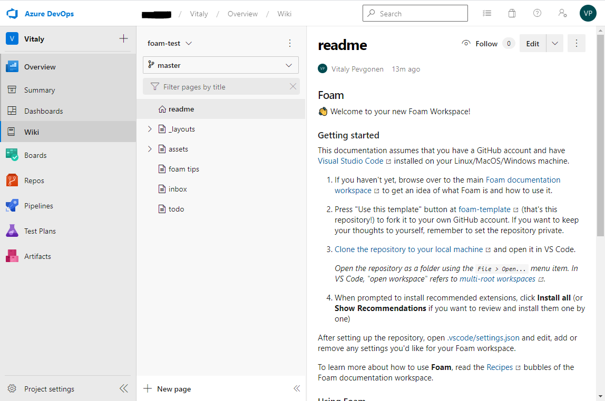

# Publish to Azure DevOps Wiki

Publish your Foam workspace as an Azure DevOps wiki.

[Azure DevOps](https://azure.microsoft.com/en-us/services/devops/) is Microsoft's collaboration software for software development teams, formerly known as Team Foundation Server (TFS) and Visual Studio Team Services. It is available as an on-premise or SaaS version. The following recipe was tested with the SaaS version, but should work the same way for the on-premise.

The following recipe is written with the assumption that you already have an [Azure DevOps](https://azure.microsoft.com/en-us/services/devops/) project.

## Setup a Foam workspace

1. Generate a Foam workspace using the [foam-template project](https://github.com/foambubble/foam-template).
2. Change the remote to a git repository in Azure DevOps (Repos -> Import a Repository -> Add Clone URL with Authentication), or copy all the files into a new Azure DevOps git repository.
3. Define which document will be the wiki home page. To do that, create a file called `.order` in the Foam workspace root folder, with first line being the document filename without `.md` extension. For a project created from the Foam template, the file would look like this:

```
readme
```

4. Push the repository to remote in Azure DevOps.

## Publish repository to a wiki

1. Navigate to your Azure DevOps project in a web browser.
2. Choose **Overview** > **Wiki**. If you don't have wikis for your project, choose **Publish code as a wiki** on welcome page.
3. Choose repository with your Foam workspace, branch (usually `master` or `main`), folder (for workspace created from foam-template it is `/`), and wiki name, and press **Publish**.

A published workspace looks like this:



There is default table of contents pane to the left of the wiki content. Here, you'll find a list of all directories that are present in your Foam workspace, and all wiki pages. Page names are derived from files names, and they are listed in alphabetical order. You may reorder pages by adding filenames without `.md` extension to `.order` file.

_Note that first entry in `.order` file defines wiki's home page._

## Update wiki

While you are pushing changes to GitHub, you won't see the wiki updated if you don't add Azure as a remote. You can push to multiple repositories simultaneously.

1.  First open a terminal and check if Azure is added running: `git remote show origin`. If you don't see Azure add it in the output then follow these steps.
2.  Rename your current remote (most likely named origin) to a different name by running: `git remote rename origin main`
3.  You can then add the remote for your second remote repository, in this case, Azure. e.g `git remote add azure https://<YOUR_ID>@dev.azure.com/<YOUR_ID>/foam-notes/_git/foam-notes`. You can get it from: Repos->Files->Clone and copy the URL.
4.  Now, you need to set up your origin remote to push to both of these. So run: `git config -e` and edit it.
5.  Add the `remote origin` section to the bottom of the file with the URLs from each remote repository you'd like to push to. You'll see something like that:

```bash
[core]
 ...
  (ignore this part)
  ...
[branch "main"]
 remote = github
 merge = refs/heads/main
[remote "github"]
 url = git@github.com:username/repo.git
 fetch = +refs/heads/*:refs/remotes/github/*
[remote "azure"]
 url = https://<YOUR_ID>@dev.azure.com/<YOUR_ID>/foam-notes/_git/foam-notes
 fetch = +refs/heads/*:refs/remotes/azure/*
[remote "origin"]
 url = git@github.com:username/repo.git
 url = https://<YOUR_ID>@dev.azure.com/<YOUR_ID>/foam-notes/_git/foam-notes
```

6.  You can then push to both repositories by: `git push origin main` or a single one using: `git push github main` or `git push azure main`

For more information, read the [Azure DevOps documentation](https://docs.microsoft.com/en-us/azure/devops/project/wiki/publish-repo-to-wiki).
