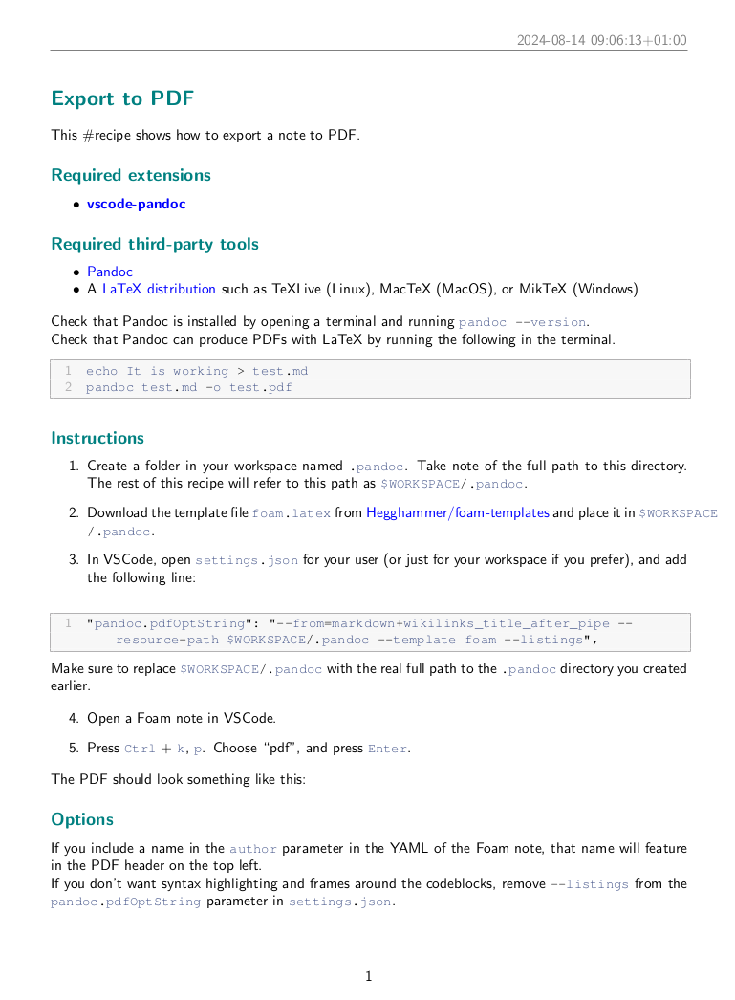

# Export to PDF

This #recipe shows how to export a note to PDF.

## Required extensions

- **[vscode-pandoc](https://marketplace.visualstudio.com/items?itemName=chrischinchilla.vscode-pandoc)**

## Required third-party tools

- [Pandoc](https://pandoc.org/installing.html)
- A [LaTeX distribution](https://www.latex-project.org/get/) such as TeXLive (Linux), MacTeX (MacOS), or MikTeX (Windows)

Check that Pandoc is installed by opening a terminal and running `pandoc --version`.

Check that Pandoc can produce PDFs with LaTeX by running the following in the terminal.

```
echo It is working > test.md
pandoc test.md -o test.pdf
```

## Instructions

1. Create a folder in your workspace named `.pandoc`. Take note of the full path to this directory. The rest of this recipe will refer to this path as `$WORKSPACE/.pandoc`.

2. Download the template file [`foam.latex`](https://raw.githubusercontent.com/Hegghammer/foam-templates/main/foam.latex) from [Hegghammer/foam-templates](https://github.com/Hegghammer/foam-templates) and place it in `$WORKSPACE/.pandoc`.

3. In VSCode, open `settings.json` for your user (or just for your workspace if you prefer), and add the following line:

```
"pandoc.pdfOptString": "--from=markdown+wikilinks_title_after_pipe --resource-path $WORKSPACE/.pandoc --template foam --listings",
```

Make sure to replace `$WORKSPACE/.pandoc` with the real full path to the `.pandoc` directory you created earlier.

4. Open a Foam note in VSCode.

5. Press `Ctrl` + `k`, `p`. Choose "pdf", and press `Enter`.

The PDF should look something like this:



## Options

If you include a name in the `author` parameter in the YAML of the Foam note, that name will feature in the PDF header on the top left.

If you don't want syntax highlighting and frames around the codeblocks, remove `--listings` from the `pandoc.pdfOptString` parameter in `settings.json`.

## Further customization

If you know some LaTeX, you can [tweak](https://bookdown.org/yihui/rmarkdown-cookbook/latex-template.html) the `foam.latex` template to your needs. Alternatively, you can supply another ready-made template such as [Eisvogel](https://github.com/Wandmalfarbe/pandoc-latex-template); just place the `TEMPLATE_NAME.latex` file in `$WORKSPACE/.pandoc`. You can also use all of Pandoc's [other functionalities](https://learnbyexample.github.io/customizing-pandoc/) by tweaking the `pandoc.pdfOptString` parameter in `settings.json`.
