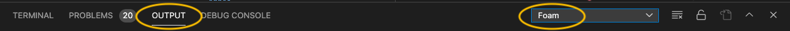

# Foam logging in VsCode

The Foam extension logs details about what its doing in vscode's `Output` tab.
Generally this is only useful if you're reporting an issue about Foam.

1. To show the tab, click on `View > Output`.
2. In the dropdown on the right of the tab, select `Foam`.

When reporting an issue about Foam, set the log level to `Debug`:

## Change the log level for the session

Execute the command `Foam: Set log level`.

## Change the default logging level

1. Open workspace settings (`cmd+,`, or execute the `Preferences: Open Workspace Settings` command)
2. Look for the entry `Foam > Logging: Level`
