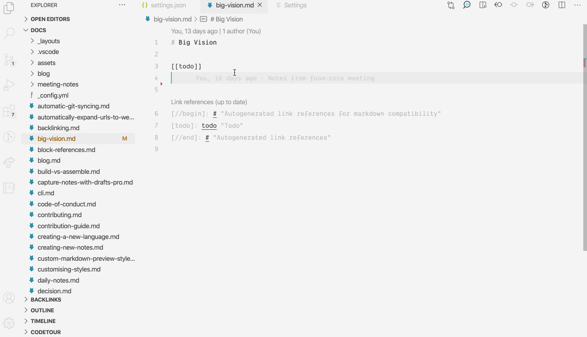

# Lint

To store your personal knowledge graph in markdown files instead of a database, we need some additional tooling to create and maintain relationships with notes.

**Foam Lint** (inspired by Andy Matuschak's [note-link-janitor](https://github.com/andymatuschak/note-link-janitor)) helps you migrate existing notes to Foam, and maintain your Foam's health over time.

Currently, Foam Lint helps you to:

- Ensure your [[link-reference-definitions]] are up to date
- Ensure every document has a well-formatted title (required for Markdown Links, Markdown Notes, and Foam Gatsby Template compatibility)

In the future, Foam Lint can help you with

- Lint, format and structure notes
- Rename and move notes around while keeping their references up to date.

## Using Lint from VS Code (Experimental)

Execute the "Foam: Lint Workspace" command from the command palette.



## Using lint from command line

Foam Lint can be installed from [NPM](https://www.npmjs.com/) and executed as a standalone CLI tool:

```sh
> npm install -g foam-cli
> foam lint path/to/workspace
```

You can run Foam Lint as a git hook on every commit to ensure your workspace links are up to date. This can be especially helpful if you edit your markdown documents from other apps.

You can also run Foam Lint from a GitHub action to ensure that all changes coming to your workspace are up to date. This can be useful when editing your Foam notes from mobile (i.e. via [GitJournal](https://gitjournal.io)), or your Foam has multiple contributors and you want to ensure that all changes are correctly integrated.

[link-reference-definitions]: ../features/link-reference-definitions.md 'Link Reference Definitions'
