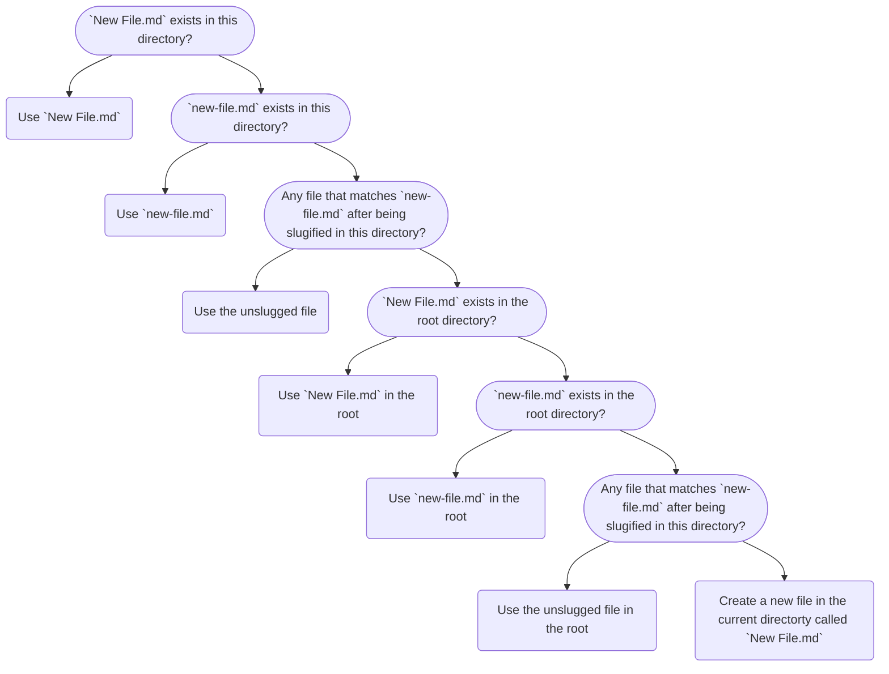

# Wiki Links

Foam enables you to Link pages together using `[[file-name]]` annotations (i.e. `[[media-wiki]]` links).

- Both `[[file-name]]` and `[[file-name.md]]` work
- Type `[[` and start typing a file name for autocompletion.
- `Cmd` + `Click` ( `Ctrl` + `Click` on Windows ) on file name to navigate to file (`F12` also works while your cursor is on the file name)
- `Cmd` + `Click` ( `Ctrl` + `Click` on Windows ) on non-existent file to create that file in the workspace.

> If the `F12` shortcut feels unnatural you can rebind it at File > Preferences > Keyboard Shortcuts by searching for `editor.action.revealDefinition`.

## Filenaming Specification

Foam is designed to be flexible to your workflow. As a result it will try to do th best thing when you link to documents.

For example:

If there was only one file in the solution called `first-file.md`, and you added the following markdown:

```markdown
Here is a link to [[another file]]
```

You now have a link to a file that doesn't exist. If you `ctrl-click` the link it wil automatically generate `another-file.md`.

Now you edit the first file more and amend the line ...

```markdown
Here is a link to [[another file]] and [[Another File]]
```
Foam decides that loosley matched files also count, so it will assume you meant `another-file.md` was the correct file to match.

However there are instances that the user may want separate versions of the same file with captialisation differences. This being a special case has to be opted in by manually creating a file `Another File.md`. Foam will know that there is a more specific version of the file, and match that instead of loosley matching.

The logic is as follows...

``` Markdown
[[New File]]
```

View the proposed flow [here](https://mermaid-js.github.io/mermaid-live-editor/#/view/eyJjb2RlIjoiZ3JhcGggVERcbiAgaWQxKFtgTmV3IEZpbGUubWRgIGV4aXN0cyBpbiB0aGlzIGRpcmVjdG9yeT9dKSAtLT4gZXhpdDEoVXNlIGBOZXcgRmlsZS5tZGApXG4gIGlkMihbYG5ldy1maWxlLm1kYCBleGlzdHMgaW4gdGhpcyBkaXJlY3Rvcnk_XSkgLS0-IGV4aXQyKFVzZSBgbmV3LWZpbGUubWRgKVxuICBpZDMoW0FueSBmaWxlIHRoYXQgbWF0Y2hlcyBgbmV3LWZpbGUubWRgIGFmdGVyIGJlaW5nIHNsdWdpZmllZCBpbiB0aGlzIGRpcmVjdG9yeT9dKSAtLT4gZXhpdDMoVXNlIHRoZSB1bnNsdWdnZWQgZmlsZSlcbiAgaWQ0KFtgTmV3IEZpbGUubWRgIGV4aXN0cyBpbiB0aGUgcm9vdCBkaXJlY3Rvcnk_XSkgLS0-IGV4aXQ0KFVzZSBgTmV3IEZpbGUubWRgIGluIHRoZSByb290KVxuICBpZDUoW2BuZXctZmlsZS5tZGAgZXhpc3RzIGluIHRoZSByb290IGRpcmVjdG9yeT9dKSAtLT4gZXhpdDUoVXNlIGBuZXctZmlsZS5tZGAgaW4gdGhlIHJvb3QpXG4gIGlkNihbQW55IGZpbGUgdGhhdCBtYXRjaGVzIGBuZXctZmlsZS5tZGAgYWZ0ZXIgYmVpbmcgc2x1Z2lmaWVkIGluIHRoaXMgZGlyZWN0b3J5P10pIC0tPiBleGl0NihVc2UgdGhlIHVuc2x1Z2dlZCBmaWxlIGluIHRoZSByb290KVxuICBleGl0NyhDcmVhdGUgYSBuZXcgZmlsZSBpbiB0aGUgY3VycmVudCBkaXJlY3RvcnR5IGNhbGxlZCBgTmV3IEZpbGUubWRgKVxuICBpZDEgLS0-IGlkMiAtLT4gaWQzIC0tPiBpZDQgLS0-IGlkNSAtLT4gaWQ2IC0tPiBleGl0NyIsIm1lcm1haWQiOnsidGhlbWUiOiJkZWZhdWx0In0sInVwZGF0ZUVkaXRvciI6ZmFsc2V9)



## Required extensions

 - [Markdown Notes](https://marketplace.visualstudio.com/items?itemName=kortina.vscode-markdown-notes) (core functionality)
 - [Foam for VSCode](https://marketplace.visualstudio.com/items?itemName=foam.foam-vscode) (for Markdown compatibility)

## Markdown compatibility

The [Foam for VSCode](https://marketplace.visualstudio.com/items?itemName=foam.foam-vscode) extension automatically generates [[link-reference-definitions]] at the bottom of the file to make wiki-links compatible with Markdown tools and parsers.

## Read more

- [[foam-file-format]]
- See [[link-reference-definition-improvements]] for further discussion on current problems and potential solutions.

[//begin]: # "Autogenerated link references for markdown compatibility"
[link-reference-definitions]: link-reference-definitions "Link Reference Definitions"
[foam-file-format]: foam-file-format "Foam File Format"
[link-reference-definition-improvements]: link-reference-definition-improvements "Link Reference Definition Improvements"
[//end]: # "Autogenerated link references"
