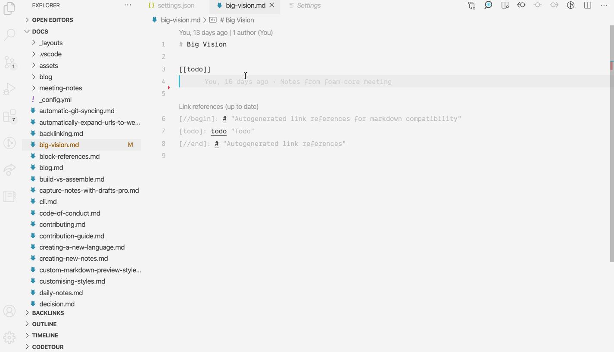

# Janitor

To store your personal knowledge graph in markdown files instead of a database, we need some additional tooling to create and maintain relationships with notes.

**Foam Janitor** (inspired by Andy Matuschak's [note-link-janitor](https://github.com/andymatuschak/note-link-janitor)) helps you migrate existing notes to Foam, and maintain your Foam's health over time.

Currently, Foam's Janitor helps you to:
- Ensure your [[link-reference-definitions]] are up to date
- Ensure every document has a well-formatted title (required for Markdown Links, Markdown Notes, and Foam Gatsby Template compatibility)

In the future, Janitor can help you with
- Updating [[materialized-backlinks]]
- Lint, format and structure notes
- Rename and move notes around while keeping their references up to date.

## Using Janitor from VS Code (Experimental)

Execute the "Foam: Run Janitor" command from the command palette.



## Using Janitor from command line (Experimental)

> ⚠️ Improvements to this documentation are welcome!

The Janitor can be installed from [NPM](https://www.npmjs.com/) and executed as a standalone CLI tool:

```sh
> npm install -g foam-cli
> foam janitor path/to/workspace
```

You can run the Janitor as a git hook on every commit to ensure your workspace links are up to date. This can be especially helpful if you edit your markdown documents from other apps. 

You can also run the Janitor from a GitHub action to ensure that all changes coming to your workspace are up to date. This can be useful when editing your Foam notes from mobile (i.e. via [GitJournal](https://gitjournal.io)), or your Foam has multiple contributors and you want to ensure that all changes are correctly integrated.

[//begin]: # "Autogenerated link references for markdown compatibility"
[link-reference-definitions]: link-reference-definitions "Link Reference Definitions"
[materialized-backlinks]: materialized-backlinks "Materialized Backlinks (stub)"
[//end]: # "Autogenerated link references"
