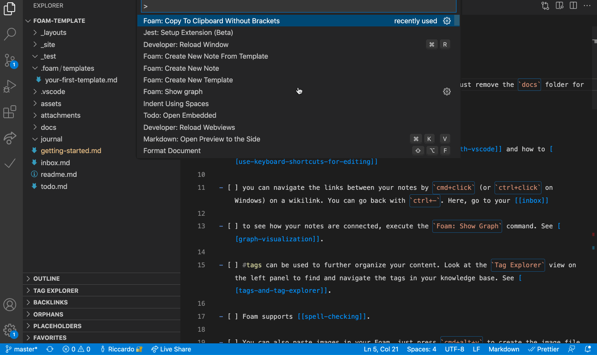
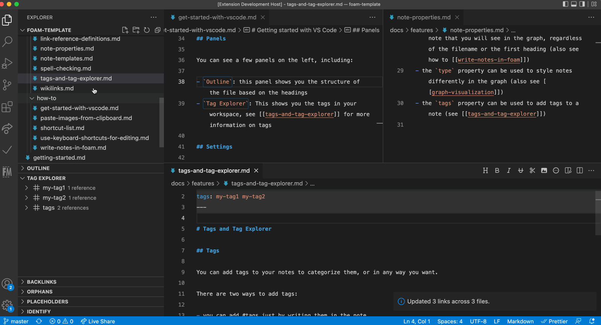
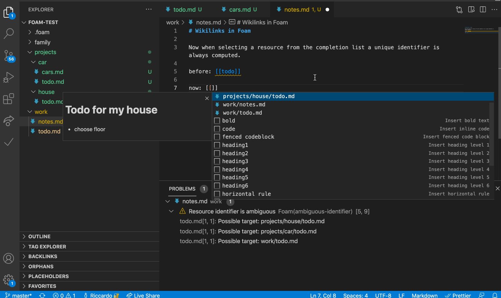
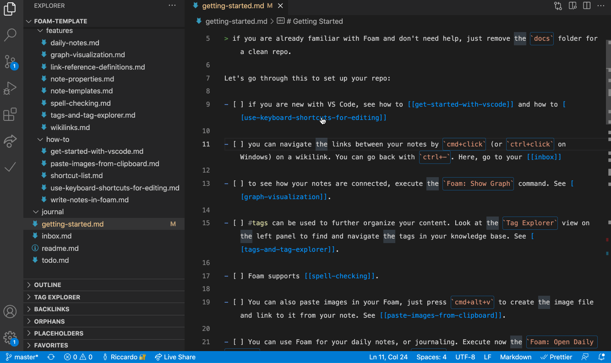
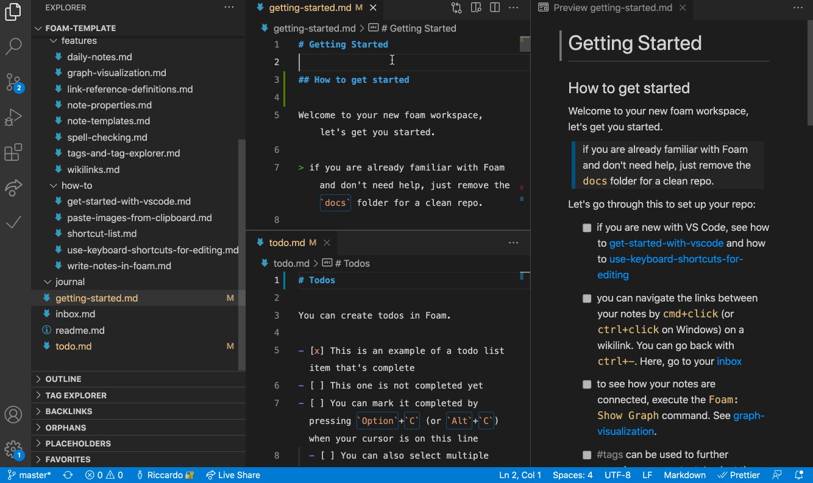
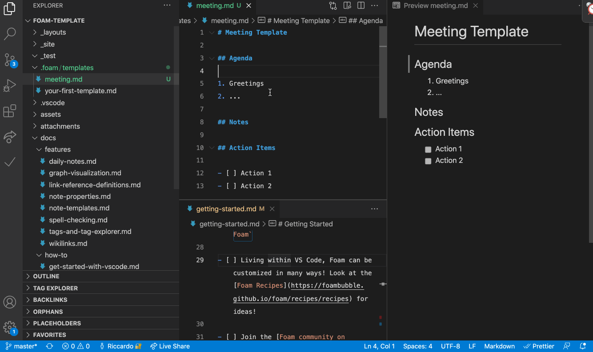
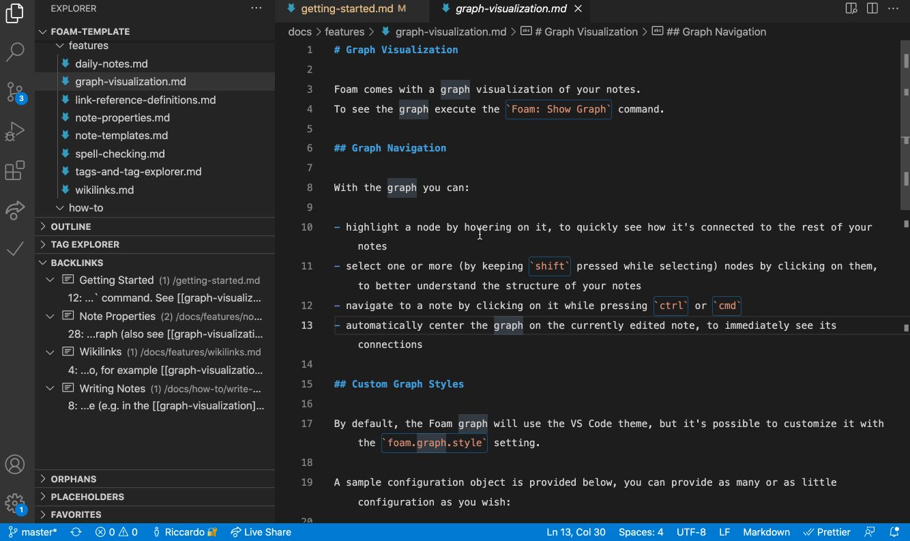
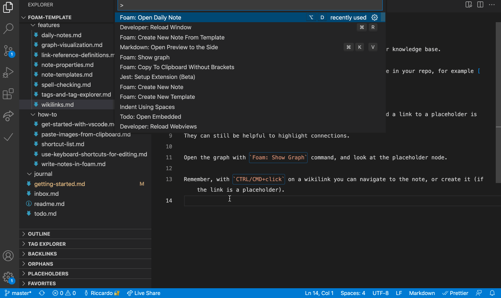
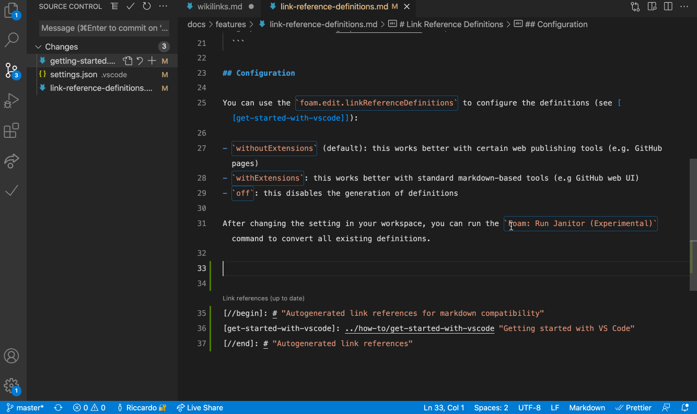

# Foam for VSCode

> You can join the Foam Community on the [Foam Discord](https://foambubble.github.io/join-discord/e)

[Foam](https://foambubble.github.io/foam) is a note-taking tool that lives within VS Code, which means you can pair it with your favorite extensions for a great editing experience.

Foam is open source, and allows you to create a local first, markdown based, personal knowledge base. You can also use it to publish your notes.

Foam is also meant to be extensible, so you can integrate with its internals to customize your knowledge base.

## Features

### Graph Visualization

See how your notes are connected via a [graph](https://foambubble.github.io/foam/features/graph-visualisation) with the `Foam: Show Graph` command.

### Link Autocompletion

Foam helps you create the connections between your notes, and your placeholders as well.

### Sync links on file rename

Foam updates the links to renamed files, so your notes stay consistent.

### Unique identifiers across directories

Foam supports files with the same name in multiple directories.
It will use the minimum identifier required, and even report and help you fix existing ambiguous wikilinks.

### Link Preview and Navigation

### Go to definition, Peek References

See where a note is being referenced in your knowledge base.

### Navigation in Preview

Navigate your rendered notes in the VS Code preview panel.

### Note embed

Embed the content from other notes.

### Support for sections

Foam supports autocompletion, navigation, embedding and diagnostics for note sections.
Just use the standard wiki syntax of `[[resource#Section Title]]`.

### Link Alias

Foam supports link aliasing, so you can have a `[[wikilink]]`, or a `[[wikilink|alias]]`.

### Templates

Use [custom templates](https://foambubble.github.io/foam/features/note-templates) to have avoid repetitve work on your notes.

### Backlinks Panel

Quickly check which notes are referencing the currently active note.
See for each occurrence the context in which it lives, as well as a preview of the note.

### Tag Explorer Panel

Tag your notes and navigate them with the [Tag Explorer](https://foambubble.github.io/foam/features/tags).
Foam also supports hierarchical tags.

### Orphans and Placeholder Panels

Orphans are note that have no inbound nor outbound links. 
Placeholders are dangling links, or notes without content.
Keep them under control, and your knowledge base in better state, by using this panel.

### Syntax highlight

Foam highlights wikilinks and placeholder differently, to help you visualize your knowledge base.

### Daily note

Create a journal with [daily notes](https://foambubble.github.io/foam/features/daily-notes).

### Generate references for your wikilinks

Create markdown [references](https://foambubble.github.io/foam/features/link-reference-definitions) for `[[wikilinks]]`, to use your notes in a non-Foam workspace.
With references you can also make your notes navigable both in GitHub UI as well as GitHub Pages.

### Commands

- Explore your knowledge base with the `Foam: Open Random Note` command
- Access your daily note with the `Foam: Open Daily Note` command
- Create a new note with the `Foam: Create New Note` command
  - This becomes very powerful when combined with [note templates](https://foambubble.github.io/foam/features/note-templates) and the `Foam: Create New Note from Template` command
- See your workspace as a connected graph with the `Foam: Show Graph` command

## Recipes

People use Foam in different ways for different use cases, check out the [recipes](https://foambubble.github.io/foam/recipes/recipes) page for inspiration!

## Getting started

You really, _really_, **really** should read [Foam documentation](https://foambubble.github.io/foam), but if you can't be bothered, this is how to get started:

1. [Create a GitHub repository from foam-template](https://github.com/foambubble/foam-template/generate). If you want to keep your thoughts to yourself, remember to set the repository private.
2. Clone the repository and open it in VS Code.
3. When prompted to install recommended extensions, click **Install all** (or **Show Recommendations** if you want to review and install them one by one).

This will also install `Foam`, but if you already have it installed, that's ok, just make sure you're up to date on the latest version.

## Requirements

High tolerance for alpha-grade software.
Foam is still a Work in Progress.
Rest assured it will never lock you in, nor compromise your files, but sometimes some features might break ;)

## Known Issues

See the [issues](https://github.com/foambubble/foam/issues/) on our GitHub repo ;)

## Release Notes

See the [CHANGELOG](CHANGELOG.md).
