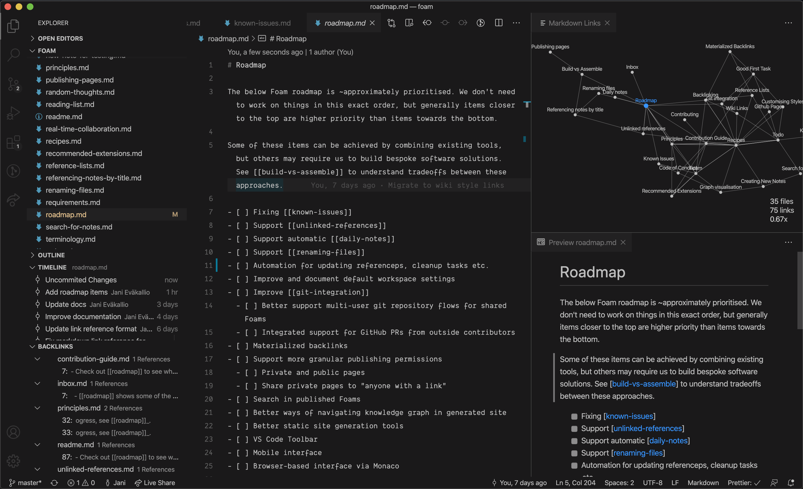

Language:  [English](https://github.com/foambubble/foam)  | 中文简体

    👋 <b>Hello 小伙伴! 也许你正在使用Github阅读此页面。 如果想获得更加的阅读体验,请查看这里 👉<a href="https://foambubble.github.io/foam">rendered Foam Workspace</a> </b>

   👀<i>这个项目是一个正在快速发展的早期项目，如果你想快速获得更新信息,你可以在Twitter关注我-<a href="https://twitter.com/jevakallio" target="_blank">@jevakallio</a>.</i>

# Foam

**Foam** 
Foam是一个受 [Roam Research](https://roamresearch.com/) 启发的个人知识管理和共享系统，基于 [Visual Studio Code](https://code.visualstudio.com/) 和 [GitHub](https://github.com/) 构建.

你可以使用 **Foam** 来组织你的知识, 保留你的笔记,编写长篇的内容, 以及选择将他们发布到网络.

**Foam** 是免费的、开源的,而且它是可拓展的,以适合你的工作流程.你用Foam创建的所有的知识和想法，都可以自由的与所有需要它的人共享。

## 我应该如何使用 Foam?

无论你是想创建一个 [Second Brain](https://www.buildingasecondbrain.com/) 或者一个 [Zettelkasten](https://zettelkasten.de/posts/overview/)，亦或者写一本书，甚至你只是想用它来记录学习。根据循以下简单的几条规则，**Foam** 就可以帮助你组织思想：

1. 按照这份 [入门指南](https://foambubble.github.io/foam#getting-started) ，为你的知识和研究创建一个**Foam**工作区。
2. 将你的想法或者文章写在markdown 文档中(我比较喜欢称它们为**泡泡**，但可能远不止这些)。这些文件应该是唯一的：将属于同一类别的文档放到一个文档中，并将其内容限制为该单个主题。 ([来源](https://zettelkasten.de/posts/overview/#principles)) 
3. 使用Foam的快捷方式和自动整合功能将您的想法与 [[wiki-links]] 链接在一起，并在它们之间导航以浏览您的知识地图。
4. 使用 [[Graph Visualisation](https://foambubble.github.io/foam/graph-visualisation)] 来获得 **Foam** 工作区的预览，使用 [[Backlinking](https://foambubble.github.io/foam/backlinking)] 来查看你这些文档之间的联系。

 Foam 就像一个浴缸：_从中获得的泡沫取决于放入的泡沫。_

## 查看更多

**转至此Foam工作区的 👉 [已发布版本](https://foambubble.github.io/foam#whats-in-a-foam)** ，以查看Foam的实际应用并阅读其余文档！

快速链接到下一个文档部分:

- [Foam 里有什么?](https://foambubble.github.io/foam#whats-in-a-foam)
- [快速开始](https://foambubble.github.io/foam#getting-started)
- [Foam 的特点](https://foambubble.github.io/foam#features)
- [Foam 的目标](https://foambubble.github.io/foam#call-to-adventure)
- [贡献与感谢](https://foambubble.github.io/foam#thanks-and-attribution)

## License

Foam 建立在MIT许可上 [MIT license](license).

[//begin]: # "Autogenerated link references for markdown compatibility"
[wiki-links]: wiki-links "Wiki Links"
[//end]: # "Autogenerated link references"
