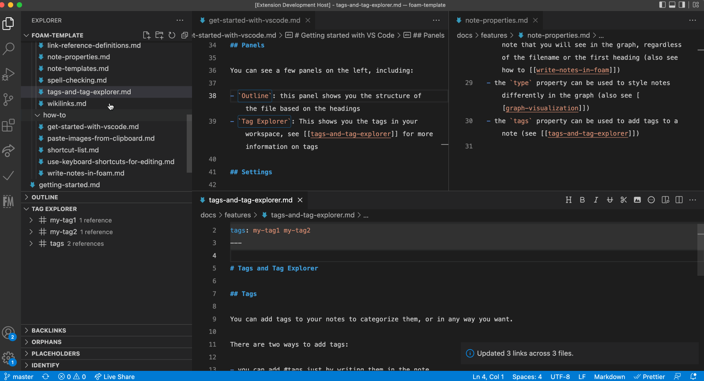

# Foam

👀*This is an early stage project under rapid development. For updates join the [Foam community Discord](https://foambubble.github.io/join-discord/g)! 💬*

<!-- ALL-CONTRIBUTORS-BADGE:START - Do not remove or modify this section -->

<!-- ALL-CONTRIBUTORS-BADGE:END -->

**Foam** is a personal knowledge management and sharing system inspired by [Roam Research](https://roamresearch.com/), built on [Visual Studio Code](https://code.visualstudio.com/) and [GitHub](https://github.com/).

You can use **Foam** for organising your research, keeping re-discoverable notes, writing long-form content and, optionally, publishing it to the web.

**Foam** is free, open source, and extremely extensible to suit your personal workflow. You own the information you create with Foam, and you're free to share it, and collaborate on it with anyone you want.

## Features

### Graph Visualization

See how your notes are connected via a [graph](https://foambubble.github.io/foam/features/graph-visualisation) with the `Foam: Show Graph` command.

### Link Autocompletion

Foam helps you create the connections between your notes, and your placeholders as well.

### Sync links on file rename

Foam updates the links to renamed files, so your notes stay consistent.

### Unique identifiers across directories

Foam supports files with the same name in multiple directories.
It will use the minimum identifier required, and even report and help you fix existing ambiguous wikilinks.

### Link Preview and Navigation

### Go to definition, Peek References

See where a note is being referenced in your knowledge base.

### Navigation in Preview

Navigate your rendered notes in the VS Code preview panel.

### Note embed

Embed the content from other notes.

### Support for sections

Foam supports autocompletion, navigation, embedding and diagnostics for note sections.
Just use the standard wiki syntax of `[[resource#Section Title]]`.

### Link Alias

Foam supports link aliasing, so you can have a `[[wikilink]]`, or a `[[wikilink|alias]]`.

### Templates

Use [custom templates](https://foambubble.github.io/foam/features/note-templates) to have avoid repetitve work on your notes.

### Backlinks Panel

Quickly check which notes are referencing the currently active note.
See for each occurrence the context in which it lives, as well as a preview of the note.

### Tag Explorer Panel

Tag your notes and navigate them with the [Tag Explorer](https://foambubble.github.io/foam/features/tags).
Foam also supports hierarchical tags.

### Orphans and Placeholder Panels

Orphans are notes that have no inbound nor outbound links. 
Placeholders are dangling links, or notes without content.
Keep them under control, and your knowledge base in a better state, by using this panel.

### Syntax highlight

Foam highlights wikilinks and placeholder differently, to help you visualize your knowledge base.

### Daily note

Create a journal with [daily notes](https://foambubble.github.io/foam/features/daily-notes).

### Generate references for your wikilinks

Create markdown [references](https://foambubble.github.io/foam/features/link-reference-definitions) for `[[wikilinks]]`, to use your notes in a non-Foam workspace.
With references you can also make your notes navigable both in GitHub UI as well as GitHub Pages.

### Commands

- Explore your knowledge base with the `Foam: Open Random Note` command
- Access your daily note with the `Foam: Open Daily Note` command
- Create a new note with the `Foam: Create New Note` command
  - This becomes very powerful when combined with [note templates](https://foambubble.github.io/foam/features/note-templates) and the `Foam: Create New Note from Template` command
- See your workspace as a connected graph with the `Foam: Show Graph` command

## Recipes

People use Foam in different ways for different use cases, check out the [recipes](https://foambubble.github.io/foam/recipes/recipes) page for inspiration!

## Getting started

Whether you want to build a [Second Brain](https://www.buildingasecondbrain.com/) or a [Zettelkasten](https://zettelkasten.de/posts/overview/), write a book, or just get better at long-term learning, **Foam** can help you organise your thoughts if you follow these simple rules:

1. Create a single **Foam** workspace for all your knowledge and research following the [[Getting started]] guide.
2. Write your thoughts in markdown documents (I like to call them **Bubbles**, but that might be more than a little twee). These documents should be atomic: Put things that belong together into a single document, and limit its content to that single topic. ([source](https://zettelkasten.de/posts/overview/#principles))
3. Use Foam's shortcuts and autocompletions to link your thoughts together with `[[wikilinks]]`, and navigate between them to explore your knowledge graph.
4. Get an overview of your **Foam** workspace using the [[Graph Visualisation]], and discover relationships between your thoughts with the use of [[Backlinking]].

You can also use our Foam template:

1. Log in on your GitHub account. 
2. [Create a GitHub repository from foam-template](https://github.com/foambubble/foam-template/generate). If you want to keep your thoughts to yourself, remember to set the repository private.
3. Clone the repository and open it in VS Code.
4. When prompted to install recommended extensions, click **Install all** (or **Show Recommendations** if you want to review and install them one by one).

This will also install `Foam`, but if you already have it installed, that's ok, just make sure you're up to date on the latest version.

## Requirements

High tolerance for alpha-grade software.
Foam is still a Work in Progress.
Rest assured it will never lock you in, nor compromise your files, but sometimes some features might break ;)

## Known Issues

See the [issues](https://github.com/foambubble/foam/issues/) on our GitHub repo ;)

## Release Notes

See the [CHANGELOG](./packages/foam-vscode/CHANGELOG.md).

## Learn more

**Head over to the 👉[Published version of this Foam workspace](https://foambubble.github.io/foam#whats-in-a-foam)** to see Foam in action and read the rest of the documentation!

Quick links to next documentation sections

- [What's in a Foam?](https://foambubble.github.io/foam#whats-in-a-foam)
- [Getting started](https://foambubble.github.io/foam#getting-started)
- [Features](https://foambubble.github.io/foam#features)
- [Call To Adventure](https://foambubble.github.io/foam#call-to-adventure)
- [Thanks and attribution](https://foambubble.github.io/foam#thanks-and-attribution)

You can also browse the [docs folder](https://github.com/foambubble/foam/tree/master/docs).

## License

Foam is licensed under the [MIT license](LICENSE).

[//begin]: # "Autogenerated link references for markdown compatibility"
[Backlinking]: docs/features/backlinking.md "Backlinking"
[//end]: # "Autogenerated link references"

## Contributors ✨

Thanks goes to these wonderful people ([emoji key](https://allcontributors.org/docs/en/emoji-key)):

<!-- ALL-CONTRIBUTORS-LIST:START - Do not remove or modify this section -->
<!-- prettier-ignore-start -->
<!-- markdownlint-disable -->
<table>
  <tr>
    <td align="center"><a href="https://jevakallio.dev/"> <b>Jani Eväkallio</b></a> <a href="https://github.com/foambubble/foam/commits?author=jevakallio" title="Code">💻</a> <a href="https://github.com/foambubble/foam/commits?author=jevakallio" title="Documentation">📖</a></td>
    <td align="center"><a href="https://joeprevite.com/"> <b>Joe Previte</b></a> <a href="https://github.com/foambubble/foam/commits?author=jsjoeio" title="Code">💻</a> <a href="https://github.com/foambubble/foam/commits?author=jsjoeio" title="Documentation">📖</a></td>
    <td align="center"><a href="https://github.com/riccardoferretti"> <b>Riccardo</b></a> <a href="https://github.com/foambubble/foam/commits?author=riccardoferretti" title="Code">💻</a> <a href="https://github.com/foambubble/foam/commits?author=riccardoferretti" title="Documentation">📖</a></td>
    <td align="center"><a href="http://ojanaho.com/"> <b>Janne Ojanaho</b></a> <a href="https://github.com/foambubble/foam/commits?author=jojanaho" title="Code">💻</a> <a href="https://github.com/foambubble/foam/commits?author=jojanaho" title="Documentation">📖</a></td>
    <td align="center"><a href="http://bypaulshen.com/"> <b>Paul Shen</b></a> <a href="https://github.com/foambubble/foam/commits?author=paulshen" title="Documentation">📖</a></td>
    <td align="center"><a href="https://github.com/coffenbacher"> <b>coffenbacher</b></a> <a href="https://github.com/foambubble/foam/commits?author=coffenbacher" title="Documentation">📖</a></td>
    <td align="center"><a href="https://mathieu.dutour.me/"> <b>Mathieu Dutour</b></a> <a href="https://github.com/foambubble/foam/commits?author=mathieudutour" title="Documentation">📖</a></td>
  </tr>
  <tr>
    <td align="center"><a href="https://github.com/presidentelect"> <b>Michael Hansen</b></a> <a href="https://github.com/foambubble/foam/commits?author=presidentelect" title="Documentation">📖</a></td>
    <td align="center"><a href="http://klickverbot.at/"> <b>David Nadlinger</b></a> <a href="https://github.com/foambubble/foam/commits?author=dnadlinger" title="Documentation">📖</a></td>
    <td align="center"><a href="https://pluckd.co/"> <b>Fernando</b></a> <a href="https://github.com/foambubble/foam/commits?author=MrCordeiro" title="Documentation">📖</a></td>
    <td align="center"><a href="https://github.com/jfgonzalez7"> <b>Juan Gonzalez</b></a> <a href="https://github.com/foambubble/foam/commits?author=jfgonzalez7" title="Documentation">📖</a></td>
    <td align="center"><a href="http://www.louiechristie.com/"> <b>Louie Christie</b></a> <a href="https://github.com/foambubble/foam/commits?author=louiechristie" title="Documentation">📖</a></td>
    <td align="center"><a href="https://supersandro.de/"> <b>Sandro</b></a> <a href="https://github.com/foambubble/foam/commits?author=SuperSandro2000" title="Documentation">📖</a></td>
    <td align="center"><a href="https://github.com/Skn0tt"> <b>Simon Knott</b></a> <a href="https://github.com/foambubble/foam/commits?author=Skn0tt" title="Documentation">📖</a></td>
  </tr>
  <tr>
    <td align="center"><a href="https://styfle.dev/"> <b>Steven</b></a> <a href="https://github.com/foambubble/foam/commits?author=styfle" title="Documentation">📖</a></td>
    <td align="center"><a href="https://github.com/Georift"> <b>Tim</b></a> <a href="https://github.com/foambubble/foam/commits?author=Georift" title="Documentation">📖</a></td>
    <td align="center"><a href="https://github.com/sauravkhdoolia"> <b>Saurav Khdoolia</b></a> <a href="https://github.com/foambubble/foam/commits?author=sauravkhdoolia" title="Documentation">📖</a></td>
    <td align="center"><a href="https://anku.netlify.com/"> <b>Ankit Tiwari</b></a> <a href="https://github.com/foambubble/foam/commits?author=anku255" title="Documentation">📖</a> <a href="https://github.com/foambubble/foam/commits?author=anku255" title="Tests">⚠️</a> <a href="https://github.com/foambubble/foam/commits?author=anku255" title="Code">💻</a></td>
    <td align="center"><a href="https://github.com/ayushbaweja"> <b>Ayush Baweja</b></a> <a href="https://github.com/foambubble/foam/commits?author=ayushbaweja" title="Documentation">📖</a></td>
    <td align="center"><a href="https://github.com/TaiChi-IO"> <b>TaiChi-IO</b></a> <a href="https://github.com/foambubble/foam/commits?author=TaiChi-IO" title="Documentation">📖</a></td>
    <td align="center"><a href="https://github.com/juanfrank77"> <b>Juan F Gonzalez </b></a> <a href="https://github.com/foambubble/foam/commits?author=juanfrank77" title="Documentation">📖</a></td>
  </tr>
  <tr>
    <td align="center"><a href="https://sanketdg.github.io"> <b>Sanket Dasgupta</b></a> <a href="https://github.com/foambubble/foam/commits?author=SanketDG" title="Documentation">📖</a> <a href="https://github.com/foambubble/foam/commits?author=SanketDG" title="Code">💻</a></td>
    <td align="center"><a href="https://github.com/nstafie"> <b>Nicholas Stafie</b></a> <a href="https://github.com/foambubble/foam/commits?author=nstafie" title="Documentation">📖</a></td>
    <td align="center"><a href="https://github.com/francishamel"> <b>Francis Hamel</b></a> <a href="https://github.com/foambubble/foam/commits?author=francishamel" title="Code">💻</a></td>
    <td align="center"><a href="http://digiguru.co.uk"> <b>digiguru</b></a> <a href="https://github.com/foambubble/foam/commits?author=digiguru" title="Code">💻</a> <a href="https://github.com/foambubble/foam/commits?author=digiguru" title="Documentation">📖</a></td>
    <td align="center"><a href="https://github.com/chirag-singhal"> <b>CHIRAG SINGHAL</b></a> <a href="https://github.com/foambubble/foam/commits?author=chirag-singhal" title="Code">💻</a></td>
    <td align="center"><a href="https://github.com/lostintangent"> <b>Jonathan Carter</b></a> <a href="https://github.com/foambubble/foam/commits?author=lostintangent" title="Documentation">📖</a></td>
    <td align="center"><a href="https://www.synesthesia.co.uk"> <b>Julian Elve</b></a> <a href="https://github.com/foambubble/foam/commits?author=synesthesia" title="Documentation">📖</a></td>
  </tr>
  <tr>
    <td align="center"><a href="https://github.com/thomaskoppelaar"> <b>Thomas Koppelaar</b></a> <a href="#question-thomaskoppelaar" title="Answering Questions">💬</a> <a href="https://github.com/foambubble/foam/commits?author=thomaskoppelaar" title="Code">💻</a> <a href="#userTesting-thomaskoppelaar" title="User Testing">📓</a></td>
    <td align="center"><a href="http://www.akshaymehra.com"> <b>Akshay</b></a> <a href="https://github.com/foambubble/foam/commits?author=MehraAkshay" title="Code">💻</a></td>
    <td align="center"><a href="http://johnlindquist.com"> <b>John Lindquist</b></a> <a href="https://github.com/foambubble/foam/commits?author=johnlindquist" title="Documentation">📖</a></td>
    <td align="center"><a href="https://ashwin.run/"> <b>Ashwin Ramaswami</b></a> <a href="https://github.com/foambubble/foam/commits?author=epicfaace" title="Documentation">📖</a></td>
    <td align="center"><a href="https://github.com/Klaudioz"> <b>Claudio Canales</b></a> <a href="https://github.com/foambubble/foam/commits?author=Klaudioz" title="Documentation">📖</a></td>
    <td align="center"><a href="https://github.com/vitaly-pevgonen"> <b>vitaly-pevgonen</b></a> <a href="https://github.com/foambubble/foam/commits?author=vitaly-pevgonen" title="Documentation">📖</a></td>
    <td align="center"><a href="https://dshemetov.github.io"> <b>Dmitry Shemetov</b></a> <a href="https://github.com/foambubble/foam/commits?author=dshemetov" title="Documentation">📖</a></td>
  </tr>
  <tr>
    <td align="center"><a href="https://github.com/hooncp"> <b>hooncp</b></a> <a href="https://github.com/foambubble/foam/commits?author=hooncp" title="Documentation">📖</a></td>
    <td align="center"><a href="http://rt-canada.ca"> <b>Martin Laws</b></a> <a href="https://github.com/foambubble/foam/commits?author=martinlaws" title="Documentation">📖</a></td>
    <td align="center"><a href="http://seanksmith.me"> <b>Sean K Smith</b></a> <a href="https://github.com/foambubble/foam/commits?author=sksmith" title="Code">💻</a></td>
    <td align="center"><a href="https://www.linkedin.com/in/kevin-neely/"> <b>Kevin Neely</b></a> <a href="https://github.com/foambubble/foam/commits?author=kneely" title="Documentation">📖</a></td>
    <td align="center"><a href="https://ariefrahmansyah.dev"> <b>Arief Rahmansyah</b></a> <a href="https://github.com/foambubble/foam/commits?author=ariefrahmansyah" title="Documentation">📖</a></td>
    <td align="center"><a href="http://vhanda.in"> <b>Vishesh Handa</b></a> <a href="https://github.com/foambubble/foam/commits?author=vHanda" title="Documentation">📖</a></td>
    <td align="center"><a href="http://www.linkedin.com/in/heroichitesh"> <b>Hitesh Kumar</b></a> <a href="https://github.com/foambubble/foam/commits?author=HeroicHitesh" title="Documentation">📖</a></td>
  </tr>
  <tr>
    <td align="center"><a href="https://spencerwoo.com"> <b>Spencer Woo</b></a> <a href="https://github.com/foambubble/foam/commits?author=spencerwooo" title="Documentation">📖</a></td>
    <td align="center"><a href="https://ingalless.com"> <b>ingalless</b></a> <a href="https://github.com/foambubble/foam/commits?author=ingalless" title="Code">💻</a> <a href="https://github.com/foambubble/foam/commits?author=ingalless" title="Documentation">📖</a></td>
    <td align="center"><a href="http://jmg-duarte.github.io"> <b>José Duarte</b></a> <a href="https://github.com/foambubble/foam/commits?author=jmg-duarte" title="Code">💻</a> <a href="https://github.com/foambubble/foam/commits?author=jmg-duarte" title="Documentation">📖</a></td>
    <td align="center"><a href="https://www.yenly.wtf"> <b>Yenly</b></a> <a href="https://github.com/foambubble/foam/commits?author=yenly" title="Documentation">📖</a></td>
    <td align="center"><a href="https://www.hikerpig.cn"> <b>hikerpig</b></a> <a href="https://github.com/foambubble/foam/commits?author=hikerpig" title="Code">💻</a></td>
    <td align="center"><a href="http://sigfried.org"> <b>Sigfried Gold</b></a> <a href="https://github.com/foambubble/foam/commits?author=Sigfried" title="Documentation">📖</a></td>
    <td align="center"><a href="http://www.tristansokol.com"> <b>Tristan Sokol</b></a> <a href="https://github.com/foambubble/foam/commits?author=tristansokol" title="Code">💻</a></td>
  </tr>
  <tr>
    <td align="center"><a href="https://umbrellait.com"> <b>Danil Rodin</b></a> <a href="https://github.com/foambubble/foam/commits?author=umbrellait-danil-rodin" title="Documentation">📖</a></td>
    <td align="center"><a href="https://www.linkedin.com/in/scottjoewilliams/"> <b>Scott Williams</b></a> <a href="https://github.com/foambubble/foam/commits?author=scott-joe" title="Documentation">📖</a></td>
    <td align="center"><a href="https://jackiexiao.github.io/blog"> <b>jackiexiao</b></a> <a href="https://github.com/foambubble/foam/commits?author=Jackiexiao" title="Documentation">📖</a></td>
    <td align="center"><a href="https://generativist.substack.com/"> <b>John B Nelson</b></a> <a href="https://github.com/foambubble/foam/commits?author=jbn" title="Documentation">📖</a></td>
    <td align="center"><a href="https://github.com/asifm"> <b>Asif Mehedi</b></a> <a href="https://github.com/foambubble/foam/commits?author=asifm" title="Documentation">📖</a></td>
    <td align="center"><a href="https://github.com/litanlitudan"> <b>Tan Li</b></a> <a href="https://github.com/foambubble/foam/commits?author=litanlitudan" title="Code">💻</a></td>
    <td align="center"><a href="http://shaunagordon.com"> <b>Shauna Gordon</b></a> <a href="https://github.com/foambubble/foam/commits?author=ShaunaGordon" title="Documentation">📖</a></td>
  </tr>
  <tr>
    <td align="center"><a href="https://mcluck.tech"> <b>Mike Cluck</b></a> <a href="https://github.com/foambubble/foam/commits?author=MCluck90" title="Code">💻</a></td>
    <td align="center"><a href="http://brandonpugh.com"> <b>Brandon Pugh</b></a> <a href="https://github.com/foambubble/foam/commits?author=bpugh" title="Code">💻</a></td>
    <td align="center"><a href="https://max.davitt.me"> <b>Max Davitt</b></a> <a href="https://github.com/foambubble/foam/commits?author=themaxdavitt" title="Documentation">📖</a></td>
    <td align="center"><a href="http://briananglin.me"> <b>Brian Anglin</b></a> <a href="https://github.com/foambubble/foam/commits?author=anglinb" title="Documentation">📖</a></td>
    <td align="center"><a href="http://deft.work"> <b>elswork</b></a> <a href="https://github.com/foambubble/foam/commits?author=elswork" title="Documentation">📖</a></td>
    <td align="center"><a href="http://leonh.fr/"> <b>léon h</b></a> <a href="https://github.com/foambubble/foam/commits?author=leonhfr" title="Code">💻</a></td>
    <td align="center"><a href="https://nygaard.site"> <b>Nikhil Nygaard</b></a> <a href="https://github.com/foambubble/foam/commits?author=njnygaard" title="Documentation">📖</a></td>
  </tr>
  <tr>
    <td align="center"><a href="http://www.nitwit.se"> <b>Mark Dixon</b></a> <a href="https://github.com/foambubble/foam/commits?author=nitwit-se" title="Code">💻</a></td>
    <td align="center"><a href="https://github.com/joeltjames"> <b>Joel James</b></a> <a href="https://github.com/foambubble/foam/commits?author=joeltjames" title="Code">💻</a></td>
    <td align="center"><a href="https://www.ryo33.com"> <b>Hashiguchi Ryo</b></a> <a href="https://github.com/foambubble/foam/commits?author=ryo33" title="Documentation">📖</a></td>
    <td align="center"><a href="https://movermeyer.com"> <b>Michael Overmeyer</b></a> <a href="https://github.com/foambubble/foam/commits?author=movermeyer" title="Code">💻</a></td>
    <td align="center"><a href="https://github.com/derrickqin"> <b>Derrick Qin</b></a> <a href="https://github.com/foambubble/foam/commits?author=derrickqin" title="Documentation">📖</a></td>
    <td align="center"><a href="https://www.linkedin.com/in/zomars/"> <b>Omar López</b></a> <a href="https://github.com/foambubble/foam/commits?author=zomars" title="Documentation">📖</a></td>
    <td align="center"><a href="http://robincn.com"> <b>Robin King</b></a> <a href="https://github.com/foambubble/foam/commits?author=RobinKing" title="Code">💻</a></td>
  </tr>
  <tr>
    <td align="center"><a href="http://twitter.com/deegovee"> <b>Dheepak </b></a> <a href="https://github.com/foambubble/foam/commits?author=dheepakg" title="Documentation">📖</a></td>
    <td align="center"><a href="https://github.com/daniel-vera-g"> <b>Daniel VG</b></a> <a href="https://github.com/foambubble/foam/commits?author=daniel-vera-g" title="Documentation">📖</a></td>
    <td align="center"><a href="https://github.com/Barabazs"> <b>Barabas</b></a> <a href="https://github.com/foambubble/foam/commits?author=Barabazs" title="Code">💻</a></td>
    <td align="center"><a href="http://enginveske@gmail.com"> <b>Engincan VESKE</b></a> <a href="https://github.com/foambubble/foam/commits?author=EngincanV" title="Documentation">📖</a></td>
    <td align="center"><a href="http://www.paulderaaij.nl"> <b>Paul de Raaij</b></a> <a href="https://github.com/foambubble/foam/commits?author=pderaaij" title="Code">💻</a></td>
    <td align="center"><a href="https://github.com/bronson"> <b>Scott Bronson</b></a> <a href="https://github.com/foambubble/foam/commits?author=bronson" title="Documentation">📖</a></td>
    <td align="center"><a href="http://rafaelriedel.de"> <b>Rafael Riedel</b></a> <a href="https://github.com/foambubble/foam/commits?author=rafo" title="Documentation">📖</a></td>
  </tr>
  <tr>
    <td align="center"><a href="https://github.com/Pearcekieser"> <b>Pearcekieser</b></a> <a href="https://github.com/foambubble/foam/commits?author=Pearcekieser" title="Documentation">📖</a></td>
    <td align="center"><a href="https://github.com/theowenyoung"> <b>Owen Young</b></a> <a href="https://github.com/foambubble/foam/commits?author=theowenyoung" title="Documentation">📖</a> <a href="#content-theowenyoung" title="Content">🖋</a></td>
    <td align="center"><a href="http://www.prashu.com"> <b>Prashanth Subrahmanyam</b></a> <a href="https://github.com/foambubble/foam/commits?author=ksprashu" title="Documentation">📖</a></td>
    <td align="center"><a href="https://github.com/JonasSprenger"> <b>Jonas SPRENGER</b></a> <a href="https://github.com/foambubble/foam/commits?author=JonasSprenger" title="Code">💻</a></td>
    <td align="center"><a href="https://github.com/Laptop765"> <b>Paul</b></a> <a href="https://github.com/foambubble/foam/commits?author=Laptop765" title="Documentation">📖</a></td>
    <td align="center"><a href="https://bandism.net/"> <b>Ikko Ashimine</b></a> <a href="https://github.com/foambubble/foam/commits?author=eltociear" title="Documentation">📖</a></td>
    <td align="center"><a href="https://github.com/memeplex"> <b>memeplex</b></a> <a href="https://github.com/foambubble/foam/commits?author=memeplex" title="Code">💻</a></td>
  </tr>
  <tr>
    <td align="center"><a href="https://github.com/AndreiD049"> <b>AndreiD049</b></a> <a href="https://github.com/foambubble/foam/commits?author=AndreiD049" title="Code">💻</a></td>
    <td align="center"><a href="https://github.com/iam-yan"> <b>Yan</b></a> <a href="https://github.com/foambubble/foam/commits?author=iam-yan" title="Documentation">📖</a></td>
    <td align="center"><a href="https://WikiEducator.org/User:JimTittsler"> <b>Jim Tittsler</b></a> <a href="https://github.com/foambubble/foam/commits?author=jimt" title="Documentation">📖</a></td>
    <td align="center"><a href="http://malcolmmielle.wordpress.com/"> <b>Malcolm Mielle</b></a> <a href="https://github.com/foambubble/foam/commits?author=MalcolmMielle" title="Documentation">📖</a></td>
    <td align="center"><a href="https://snippets.page/"> <b>Veesar</b></a> <a href="https://github.com/foambubble/foam/commits?author=veesar" title="Documentation">📖</a></td>
    <td align="center"><a href="https://github.com/bentongxyz"> <b>bentongxyz</b></a> <a href="https://github.com/foambubble/foam/commits?author=bentongxyz" title="Code">💻</a></td>
    <td align="center"><a href="https://brianjdevries.com"> <b>Brian DeVries</b></a> <a href="https://github.com/foambubble/foam/commits?author=techCarpenter" title="Code">💻</a></td>
  </tr>
  <tr>
    <td align="center"><a href="http://Cliffordfajardo.com"> <b>Clifford Fajardo </b></a> <a href="#tool-cliffordfajardo" title="Tools">🔧</a></td>
    <td align="center"><a href="http://cu-dev.ca"> <b>Chris Usick</b></a> <a href="https://github.com/foambubble/foam/commits?author=chrisUsick" title="Code">💻</a></td>
    <td align="center"><a href="https://github.com/josephdecock"> <b>Joe DeCock</b></a> <a href="https://github.com/foambubble/foam/commits?author=josephdecock" title="Code">💻</a></td>
    <td align="center"><a href="http://www.drewtyler.com"> <b>Drew Tyler</b></a> <a href="https://github.com/foambubble/foam/commits?author=drewtyler" title="Documentation">📖</a></td>
    <td align="center"><a href="https://github.com/Lauviah0622"> <b>Lauviah0622</b></a> <a href="https://github.com/foambubble/foam/commits?author=Lauviah0622" title="Code">💻</a></td>
    <td align="center"><a href="https://www.elastic.co/elastic-agent"> <b>Josh Dover</b></a> <a href="https://github.com/foambubble/foam/commits?author=joshdover" title="Code">💻</a></td>
    <td align="center"><a href="http://phelm.co.uk"> <b>Phil Helm</b></a> <a href="https://github.com/foambubble/foam/commits?author=phelma" title="Documentation">📖</a></td>
  </tr>
</table>

<!-- markdownlint-restore -->
<!-- prettier-ignore-end -->

<!-- ALL-CONTRIBUTORS-LIST:END -->

This project follows the [all-contributors](https://github.com/all-contributors/all-contributors) specification. Contributions of any kind welcome!
