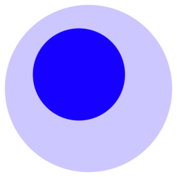

# Foam

> [English](readme.md) | **简体中文**

👀**这是个处于快速发展阶段的早期项目。有关更新，请加入 [Discord Foam 社区](https://foambubble.github.io/join-discord/g)！💬**

<!-- ALL-CONTRIBUTORS-BADGE:START - Do not remove or modify this section -->

<!-- ALL-CONTRIBUTORS-BADGE:END -->

**Foam** 是一个个人知识库管理和共享系统，其灵感来自 [Roam Research](https://roamresearch.com/)，建立在 [Visual Studio Code](https://code.visualstudio.com/) 和 [GitHub](https://github.com/) 之上。

你可以用 **Foam** 来使你的研究条理清晰，或用来保存值得细品的笔记，亦或是用于撰写长篇内容，也可以选择将其发布到网络。

**Foam** 免费开源且极具可扩展性，以适应你的个人工作流程。你拥有你用 Foam 创建的信息，你可以无拘无束地分享它，并与你想要的人协作。

## 我该如何使用 Foam？

无论你是想建立一个[第二大脑](https://www.buildingasecondbrain.com/)还是想用[卢曼卡片盒笔记法](https://zettelkasten.de/posts/overview/)写本书，或者只是想在长期学习中变得更好，只要你遵循这些简单的规则，**Foam** 就能帮你组织好你的想法。

1. 按照 [[Getting started (入门)]] 指南，给你所有的知识和研究创建一个独立的 **Foam** 工作区。
2. 把你的想法写在 markdown 文档中（我喜欢将其成为 **Bubbles**，但这可能有些过于俗气了）。这些文件应该具有原子性。把属于自己的东西放在一个文件里，并把它的内容限制在此单一主题上。（[来源](https://zettelkasten.de/posts/overview/#principles)）
3. 使用 Foam 的快捷键和自动完成功能，将你的想法与 `[[wiki-links (双链)]]` 联系起来，并在它们之间进行导航，探索你的知识图谱。
4. 用 [[Graph Visualisation (图形可视化)]] 获取你的 **Foam** 工作空间概况，并使用 [[Backlinking (反链)]] 发现你的想法之间的关系。

Foam 就像是聚宝盆: **你从它那里得到什么，取决于你向它投入什么。**

## 学习更多

**前往👉[此 Foam 工作区的发行版本](https://foambubble.github.io/foam#whats-in-a-foam)** 查看 Foam 的实际作用并阅读其余文档!

快速链接至下一个文档章节

- [What's in a Foam? (什么是 Foam？)](https://foambubble.github.io/foam#whats-in-a-foam)
- [Getting started (入门)](https://foambubble.github.io/foam#getting-started)
- [Features (特性)](https://foambubble.github.io/foam#features)
- [Call To Adventure (冒险的召唤)](https://foambubble.github.io/foam#call-to-adventure)
- [Thanks and attribution (感谢和署名)](https://foambubble.github.io/foam#thanks-and-attribution)

你也可以浏览 [docs 文件夹](https://github.com/foambubble/foam/tree/master/docs)。

## 许可证

Foam 在 [MIT 许可证](LICENSE)下进行授权。

[//begin]: # "Autogenerated link references for markdown compatibility"
[wiki-links (双链)]: docs/wiki-links.md "Wiki Links"
[Getting started (入门)]: docs/index.md "Getting started"
[Graph Visualisation (图形可视化)]: docs/features/graph-visualisation.md "Graph Visualisation"
[Backlinking (反链)]: docs/features/backlinking.md "Backlinking"
[//end]: # "Autogenerated link references"

## 贡献者 ✨

前往英文版[查看全体贡献者](readme.md#contributors-)。
