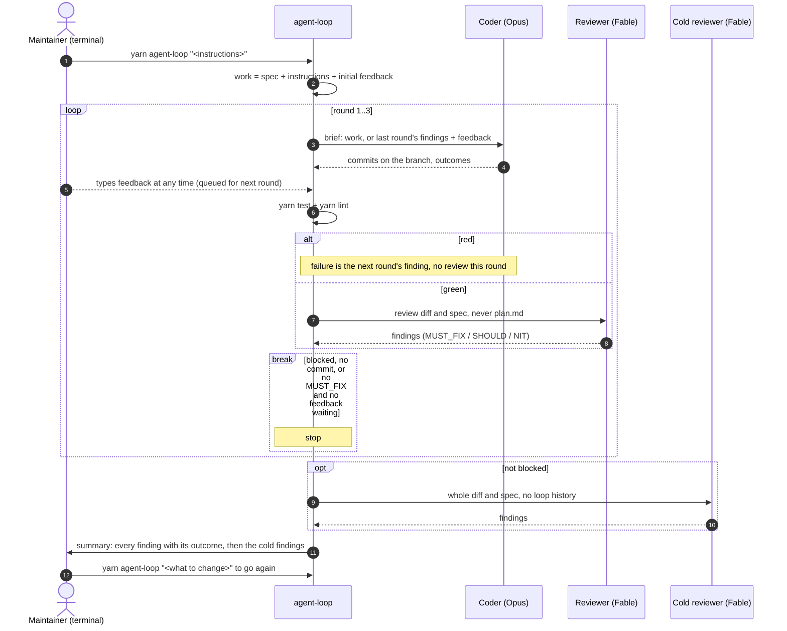

# Implement and review loop

## Context

Implementing a spec has settled into a cycle of implement, review,
implement, review, with the maintainer relaying between each step. The loop
runs that cycle on its own: a coder session and a reviewer session alternate
for up to three rounds, with the test suite between them, so what reaches the
maintainer has already been vetted.

A first version was prototyped as a script that never reached `main`. It
grew over a dozen conversational turns without a spec, was never run, and
had one known defect: output from a previous run was read as if it were the
current one.
This spec is the contract the loop meets before its first run.

Decisions already taken, recorded here so the criteria below read as
consequences rather than choices:

- **It is a command-line tool, run locally.** A private workspace package in
  this repo, invoked as `yarn agent-loop [instructions]` from the branch to
  work on. Being a package gives it dependencies and tests, and its tests run
  in CI on every PR like any other package's, which is what makes the `unit`
  criteria below a promise. It is not called `dev-loop`, which is the name of
  a separate tool.
- **Three parts vary by where it runs, and the loop reaches them only through
  a boundary**: where the maintainer's feedback comes from, what performs the
  cold pass, and where the result goes. This spec defines the loop and the
  local version of each. `agent-loop-ci` supplies the GitHub versions; the
  loop itself does not change between the two.
- **Locally the maintainer steers from the terminal.** Progress prints as the
  loop runs, and the prompt stays open: anything typed becomes a finding for
  the next round.
- **The test suite is the first review.** `yarn test` and `yarn lint` run
  after every coder round, and red code never reaches the reviewer.
- **The cold pass reports to the maintainer, never to the loop.** Once the
  loop ends, a reviewer with none of the loop's history reads the whole
  change. Its findings are for a person to act on, so a cold pass can't turn
  into another round nobody asked for.
- **Relationship to dev-loop** (`~/code/dev-loop`): the loop borrows its core
  rule, orchestration in code and judgment in prompts, its suite gate between
  coder and reviewer, and its cold pass. It deliberately leaves out the drift
  table and machine-checked test citations, resumable state, the budget and
  the state machine, which solve problems this loop has not had. dev-loop is
  untouched.

A local run:

## Acceptance criteria

### Starting

- **AC-1**: Given a branch with no `spec.md` under `specs/<slug>/` or
  `specs.local/<slug>/`, the default branch included, when the loop runs,
  then it stops before any session starts, says where it looked, and names
  `/write-spec` as the way to start. Work without a spec is a plain Claude
  Code session, not a loop.
  _verify: unit_

- **AC-2**: Given a branch with a spec, when the loop runs, then round 1's
  coder is briefed with the spec.
  _verify: unit_

- **AC-3**: Given instructions passed to the loop, when round 1's coder is
  briefed, then the brief contains them verbatim alongside the spec.
  _verify: unit_

- **AC-4**: Given feedback is already waiting when the loop starts, when
  round 1's coder is briefed, then that feedback is in the brief as findings
  alongside the spec.
  _verify: unit_

### Rounds

- **AC-5**: Given a coder round that made at least one commit, when
  `yarn test` or `yarn lint` fails, then no reviewer session runs in that
  round, the failure output is the finding the next round's coder is briefed
  with, and the round counts toward the cap.
  _verify: unit_

- **AC-6**: Given a coder round that made at least one commit, when the suite
  and lint are green, then a reviewer session runs on the branch's diff
  against `origin/main`, and that session cannot read `specs/**/plan.md`.
  _verify: human_

- **AC-7**: Given the maintainer types a message in the terminal while a
  round runs, then it joins the next round's findings, a message is never
  briefed twice, and the running session is not interrupted.
  _verify: unit_

- **AC-8**: Given a round has ended, when any of these holds, then the loop
  stops and the summary names which: the coder reported `blocked`; the round
  made no commit; the reviewer reported no `MUST_FIX` finding and no feedback
  is waiting; the round cap was reached.
  _verify: unit_

- **AC-9**: Given a session whose output is missing or does not have the
  expected shape, when the loop reads it, then the run stops with an error
  naming the session. Output from a previous run or round is never read in
  its place.
  _verify: unit_

- **AC-10**: Given a run, when it records what each session returned and
  what each suite run printed, then the record lives under
  `.agent-loop/<slug>/<run>/round-N/`, with `<run>` a timestamp, round
  numbering starting at 1 for every run, and a second run leaving the first
  run's files untouched.
  _verify: unit_

### Ending

- **AC-11**: Given the loop has ended and the coder did not report
  `blocked`, then a cold pass reads the whole diff against `origin/main` and
  the spec, with none of the loop's findings, outcomes or history, and its
  findings go into the summary for the maintainer, never to a coder.
  _verify: unit_

- **AC-12**: Given the loop has ended locally, then its commits stay on the
  local branch, nothing is pushed or posted, and the summary is printed.
  _verify: unit_

- **AC-13**: Given the summary, when it is rendered, then every finding the
  loop received, from the reviewer, the suite, the maintainer or the cold
  pass, appears with its outcome and reason or as open, and all of it comes
  from the sessions' output as returned: no session retells another's
  findings or outcomes.
  _verify: unit_

## Out of scope

- Running from GitHub: the PR comment that starts it, PR threads and failing
  checks as feedback, pushing, and `review.yml` as the cold pass. That is
  `agent-loop-ci`.
- Reading a PR's threads and checks during a local run. If it is ever
  wanted, it belongs in `agent-loop-ci`, as the GitHub feedback source wired
  into a local run.
- Keeping the prompt open after the loop ends to start another pass. Running
  it again with instructions does the same thing.
- Stopping a run from the prompt. Ctrl-C does that.
- Resuming a crashed run, a cost budget, a drift table, or machine-checked
  test citations. Borrowed from dev-loop only when this loop has the problem
  they solve.
- Merging the spec and plan stages into one. Decided, separate work.
- Any change to dev-loop.
